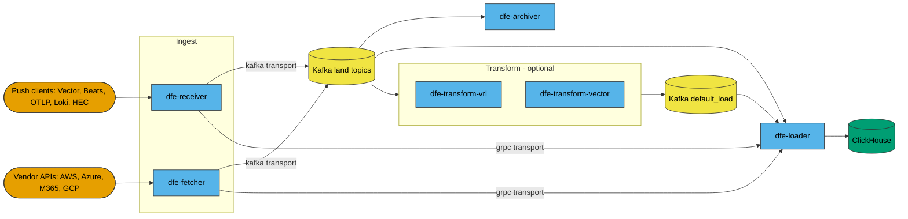
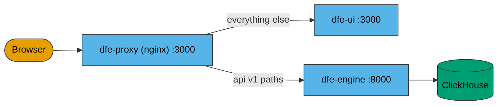
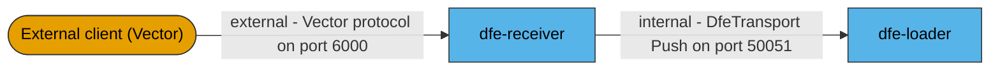
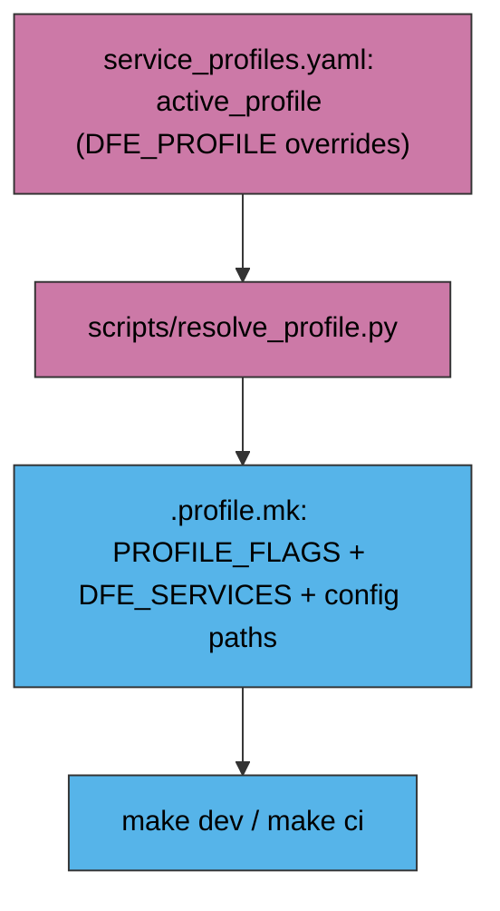

<!--
Project:   dfe-docker
File:      ARCHITECTURE.md
Purpose:   How the DFE Compose stack fits together
Language:  Markdown

License:   BUSL-1.1
Copyright: (c) 2026 HYPERI PTY LIMITED
-->

# Architecture

This repo is **packaging, not product**. It ships a `docker-compose.yml`, the
config files the DFE components mount, and the Python helpers that resolve a
profile and pin image versions. It builds no production image and publishes
nothing: it either pulls the components from GHCR, or builds `:local` images
from component source that is checked out beside this repo.

The components themselves live in their own repos and own their own Dockerfiles.
When something in the data path is wrong, the fix is almost always in a component
repo, not here.

## The data pipeline

Events arrive two ways -- pushed to `dfe-receiver`, or pulled by `dfe-fetcher` --
and leave one way: `dfe-loader` writes them to ClickHouse. Everything between is
optional and profile-selected.

Transport is a per-profile choice, not a global one. On a `kafka-*` profile the
ingest components produce to a `*_land` topic derived from the event's `_source`
field, and the loader consumes `topic_regex: .*_land`
(`config/loader/kafka.yaml`). On a `grpc-*` profile there
is no broker at all -- the ingest components dial `http://dfe-loader:50051`
directly (`config/receiver/grpc.yaml`, `config/fetcher/aws-grpc.yaml`).

The transform components are Kafka-only by construction: both read a topic and
write a topic. When one is in the profile the loader switches to
`config/loader/kafka-load.yaml` and consumes `default_load` instead. `dfe-archiver`
is likewise Kafka-only -- it consumes `default_land` and writes to its archive
volume.

Alongside the data path sits the management plane, which is independent of the
transport and toggled as a unit by `DFE_CORE_ENABLED` (default true):

`dfe-proxy` exists to give the UI and the engine API one origin, because the UI
client calls the engine with a relative `/api/v1/...` base URL
(`config/proxy/nginx.conf`).

## The two gRPC surfaces are not the same thing

Two ports in this stack speak gRPC and they are routinely confused. They are
different protocols with different audiences.

| Port | Owner | Protocol | Audience | Host binding |
|---|---|---|---|---|
| 6000 | dfe-receiver | Vector protocol, an ingest source | External clients | `DFE_INGRESS_BIND_HOST` (default `0.0.0.0`) |
| 50051 | dfe-loader | `DfeTransport/Push`, the internal transport | dfe-receiver, dfe-fetcher | `DFE_BIND_HOST` (default `127.0.0.1`) |

The binding split is the tell: 6000 is meant to be reachable, 50051 is not. Which
inbound sources the receiver actually serves is a receiver-config question and
lives in the component repo; this repo only publishes the ports.

## Two independent selectors decide what runs

Compose profiles select **infrastructure**. `service_profiles.yaml` selects **DFE
services**. `scripts/resolve_profile.py` reads the second and derives the flags
for the first, writing `.profile.mk` for the Makefile to include.

Compose profiles, and what each holds:

| Profile | Services |
|---|---|
| `clickhouse` | `clickhouse` |
| `kafka-redpanda` | `kafka-redpanda`, `kafka-init-redpanda` |
| `kafka-apache` | `kafka-apache`, `kafka-init-apache` |
| `kafka-ui` | `kafka-ui` (Kafbat) |
| `dfe` | `dlq-init`, `dfe-archiver`, `dfe-fetcher`, `dfe-loader`, `dfe-receiver`, `dfe-transform-vector`, `dfe-transform-vrl` |
| `core` | `dfe-engine`, `dfe-ui`, `dfe-proxy` |
| `hyperdx` | `hyperdx`, `hyperdx-ferretdb`, `hyperdx-postgres` |

The `dfe` profile is the whole set of data-path services; which of them actually
start is `service_profiles.yaml`'s call, because the Makefile names services
explicitly on `up`. `resolve_profile.py` always adds `clickhouse`, adds the
selected Kafka backend plus `kafka-ui` when the profile's transport is `kafka`,
adds the `core` services unless `DFE_CORE_ENABLED` is falsy, and adds the HyperDX
services only when `DFE_HYPERDX_ENABLED` is truthy. Each profile entry also names
the config file that service mounts, which is how one service gets a Kafka config
and another a gRPC one without a second compose file.

## dfe-engine is the schema authority

Nothing in this repo provisions a ClickHouse table. `dfe-engine` ships
`/app/schemas` inside its own image (pinned by `DFE_ENGINE_VERSION`), creates the
ClickHouse objects at startup, and registers the schemas that `dfe-loader`
pre-warms into its cache. A loader started before the engine is healthy holds
messages pending-schema and eventually dead-letters them, which is why the e2e
harness brings ClickHouse and the engine up first and gates on the engine's
health before any DFE service.

The practical consequence for a schema question: `dfe-schemas` rides inside the
engine image, so there is no separate schema pin here, and a schema change is a
`dfe-engine` release, not a change to this repo.

> **Note:** this repo carried `clickhouse/ddls/*.sql` and `clickhouse/init-dfe.sql`
> from before that model, and they have been deleted. Nothing ever mounted or
> executed them, but they read like the schema and one reviewer duly concluded the
> marker mechanism was broken by checking against them. The only file the
> ClickHouse service mounts is `clickhouse/default-user.xml`. If a DDL file
> reappears here, it is wrong by construction -- the engine owns the schema.

## The Kafka backend is swappable

Two brokers, mutually exclusive, chosen by `KAFKA_BACKEND` (`redpanda` default,
`apache` opt-in). Both expose the network alias `kafka` on the same host ports,
so every config addresses `kafka:9092` and neither downstream services nor the
test harness know which is running.

Each backend has its **own** topic-init service, using its own tooling: `rpk` for
Redpanda, `kafka-topics.sh` for Apache. That is the point of the split -- a single
shared init service ran the Redpanda image on both profiles, so choosing Apache to
stay clear of the BSL still pulled and ran a BSL artefact. Downstream services
depend on both init services with `required: false`, so the one that does not
exist for the active profile is a no-op.

Compose interpolates every service before profiles filter anything, so
`REDPANDA_VERSION` must still be pinned for the file to resolve even on the Apache
path. A pin is not a deployment, but it is a remaining reference.

## Component source repos

Dev builds expect these checked out beside `dfe-docker`. Image names are taken
from the `image:` lines in `docker-compose.yml`; the registry prefix is
`IMAGE_REGISTRY`, default `ghcr.io/hyperi-io`.

| Repo | Language | Role | In this stack |
|---|---|---|---|
| `dfe-receiver` | Rust | Push ingest; compose publishes HTTP `:8080` and Vector gRPC `:6000`, with OTLP, Beats and HEC ports present but commented out | `dfe` profile |
| `dfe-fetcher` | Rust | Pull ingest from vendor APIs | `dfe` profile |
| `dfe-loader` | Rust | Writes to ClickHouse; hosts `DfeTransport/Push` | `dfe` profile |
| `dfe-archiver` | Rust | Archive sink (filesystem, S3, MinIO, GCS, Azure Blob) | `dfe` profile |
| `dfe-transform-vector` | Rust | Vector.dev subprocess wrapper, Kafka to Kafka | `dfe` profile |
| `dfe-transform-vrl` | Rust | Embedded VRL transform engine | `dfe` profile |
| `dfe-engine` | Python | Config and schema API; the schema authority | `core` profile |
| `dfe-ui` | TypeScript | Web console | `core` profile |
| `dfe-hyperdx` | TypeScript | HyperDX fork (observability UI). Note the repo is `dfe-hyperdx` while the image it publishes is `hyperi-hyperdx` -- check out the former | `hyperdx` profile |

`dfe-transform-elastic`, `dfe-transform-splack` and `dfe-transform-wasm` exist as
repos but have no service in `docker-compose.yml`, so this stack cannot run them.

## Relationship to Kubernetes

Kubernetes is the primary DFE deployment path. Compose is supported for small
environments -- a single box, an edge site, a partner deployment where a cluster
is not justified -- and is not co-equal. If both would work, choose Kubernetes.

What makes Compose safe to deploy is that it consumes *the same image from the
same registry* as the cluster path. There is no promotion step and no
Compose-specific build. The version pins come from the same DFE stack SSoT
(`dfe-infra`, via `make stack`), so a Compose deployment and a cluster deployment
of the same stack version run identical digests.

Two known asymmetries, both deliberate:

- **No authentication here.** OIDC and Envoy are Kubernetes-only. Compose runs in
  god-mode.
- **`hyperi-hyperdx` is unpinned.** The fork is unpublished, so the stack SSoT
  cannot pin it and it falls back to `:latest`. It is the only image in the stack
  without a digest, and only on the opt-in `hyperdx` profile.

The self-monitoring OTel acceptance test also does not run here: this profile
carries no OTel collector and no `otel` ClickHouse database, so that test lives in
the `dfe-infra` post-deploy bootstrap-smoke suite.
