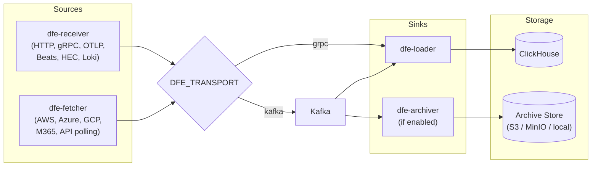

# dfe-docker

Docker Compose deployment packaging for HyperI Data Forwarding Engine (DFE 2.2).

## Data Flow



## Quickstart

### Prerequisites

- Docker and Docker Compose v2
- Python 3

### 1. Docker — Full Stack

```bash
cp .env.example .env          # Edit if needed (versions, ports)
make ci                       # Start receiver + loader + Kafka (if needed) + ClickHouse
make test                     # Send test events and verify ClickHouse
make dev-logs                 # Tail logs
make down                     # Stop everything
```

### 2. Bare-Metal — Infrastructure Only

Use this to test locally-compiled receiver/loader binaries against containerised
Kafka and ClickHouse.

```bash
make infra                    # Start Kafka + ClickHouse only

# In separate terminals:
./bin/dfe-receiver --config config/receiver-grpc.yaml
./bin/dfe-loader --config config/loader-grpc.yaml

# Test:
make test
make verify
```

Place binaries in `bin/` (gitignored). Copy from component repo `dist/`
directories or download from JFrog.

## Service Profiles

Service selection is controlled by `services.yaml` at the repo root. Each profile
declares a transport mode and which DFE services to start. Override the active
profile via the `DFE_PROFILE` env var.

```bash
make dev                              # uses active_profile from services.yaml
DFE_PROFILE=grpc-full make dev        # override profile
```

### Application Profiles (services.yaml)

| Profile | Transport | Services |
|---------|-----------|----------|
| `kafka-minimal` | Kafka | dfe-loader |
| `kafka-full` | Kafka | dfe-archiver, dfe-fetcher, dfe-loader, dfe-receiver |
| `grpc-minimal` | gRPC | dfe-loader |
| `grpc-full` | gRPC | dfe-fetcher, dfe-loader, dfe-receiver |

### Infrastructure Profiles (docker-compose.yml)

| Profile | Service | Use Case |
|---------|---------|----------|
| `clickhouse` | ClickHouse | Local analytics store |
| `kafka` | Apache Kafka KRaft | Kafka transport |
| `ui` | Kafbat UI (:8081) | Web UI for Kafka |

Infrastructure profiles are activated automatically based on the selected
application profile. The `ui` profile can be added manually:

```bash
docker compose --profile ui up -d
```

## Make Commands

### Services

| Command | Description |
|--------|-------------|
| `make dev` | Build from local source and start stack |
| `make build-local` | Build images from local source |
| `make ci` | Start stack using published registry images |
| `make pull` | Pull latest images from registry |
| `make infra` | Start infrastructure only |
| `make certs` | Create self-signed dev certs |
| `make ps` | Show running containers |
| `make down` | Stop all services |
| `make clean` | Stop all services and remove volumes |

### Logging

| Command | Description |
|--------|-------------|
| `make dev-logs` | Tail all service logs |
| `make infra-logs` | Tail infrastructure logs |

### Testing

| Command | Description |
|--------|-------------|
| `make test-infra` | Smoke test infrastructure |
| `make test` | Send test events and verify in ClickHouse |
| `make test-e2e` | End-to-end test executor |
| `make test-vector` | Feed events via Vector |
| `make verify` | Query ClickHouse to check ingested data |

## Configuration

Config files are in `config/`. The active config for each service is set by the
selected profile in `services.yaml`.

| File | Transport | Service |
|------|-----------|---------|
| `archiver-kafka.yaml` | Kafka | dfe-archiver |
| `fetcher-aws-grpc.yaml` | gRPC | dfe-fetcher |
| `fetcher-aws-kafka.yaml` | Kafka | dfe-fetcher |
| `loader-grpc.yaml` | gRPC | dfe-loader |
| `loader-kafka.yaml` | Kafka | dfe-loader |
| `receiver-grpc.yaml` | gRPC | dfe-receiver |
| `receiver-kafka.yaml` | Kafka | dfe-receiver |

## Environment Variables

See [.env.example](.env.example) for available overrides.

### Profile Selection

| Variable | Use | Default |
|----------|-----|---------|
| `DFE_PROFILE` | Override active profile from services.yaml | *(unset — uses services.yaml)* |

### Architecture

| Variable | Use | Default |
|----------|-----|---------|
| `IMAGE_ARCHITECTURE` | Architecture of the image to use | `linux/amd64` |

### Dev Builds

| Variable | Use | Default |
|----------|-----|---------|
| `PROJECTS_PATH` | Parent directory containing DFE source repos (used by `docker-compose.override.yml`) | `/projects` |

### DFE Components — General

| Variable | Use | Default |
|----------|-----|---------|
| `LOG_LEVEL` | Log level (trace\|debug\|info\|warn\|error) | `info` |
| `LOG_FORMAT` | Log format | `text` |

### DFE Archiver

| Variable | Use | Default |
|----------|-----|---------|
| `DFE_ARCHIVER_VERSION` | Version of dfe-archiver to use | `latest` |
| `DFE_ARCHIVER_PROMETHEUS_PORT` | Archiver Prometheus port | `9093` |

### DFE Fetcher

| Variable | Use | Default |
|----------|-----|---------|
| `DFE_FETCHER_VERSION` | Version of dfe-fetcher to use | `latest` |
| `DFE_FETCHER_INGEST_PORT` | Fetcher ingest port | `8082` |
| `DFE_FETCHER_PROMETHEUS_PORT` | Fetcher Prometheus port | `9094` |
| `AWS_REGION` | AWS region for fetcher sources | `us-east-1` |
| `AWS_ACCESS_KEY_ID` | AWS access key | *(empty)* |
| `AWS_SECRET_ACCESS_KEY` | AWS secret key | *(empty)* |

### DFE Loader

| Variable | Use | Default |
|----------|-----|---------|
| `DFE_LOADER_VERSION` | Version of dfe-loader to use | `latest` |
| `DFE_LOADER_PROMETHEUS_PORT` | Loader Prometheus port | `9091` |
| `DFE_LOADER_GRPC_PORT` | Loader gRPC port | `50051` |

### DFE Receiver

| Variable | Use | Default |
|----------|-----|---------|
| `DFE_RECEIVER_VERSION` | Version of dfe-receiver to use | `latest` |
| `DFE_RECEIVER_BEATS_PORT` | Receiver Beats port | `5044` |
| `DFE_RECEIVER_GRPC_PORT` | Receiver gRPC port | `6000` |
| `DFE_RECEIVER_HEC_PORT` | Receiver HEC port | `8088` |
| `DFE_RECEIVER_HTTP_PORT` | Receiver HTTP port | `8080` |
| `DFE_RECEIVER_OTLP_GRPC_PORT` | Receiver OTLP gRPC port | `4317` |
| `DFE_RECEIVER_OTLP_HTTP_PORT` | Receiver OTLP HTTP port | `4318` |
| `DFE_RECEIVER_PROMETHEUS_PORT` | Receiver Prometheus port | `9090` |

### ClickHouse

| Variable | Use | Default |
|----------|-----|---------|
| `CLICKHOUSE_VERSION` | Version of ClickHouse to use | `latest` |
| `CLICKHOUSE_HOST` | External ClickHouse host (skips Docker container) | `clickhouse` |
| `CLICKHOUSE_HTTP_PORT` | ClickHouse HTTP port | `8123` |
| `CLICKHOUSE_NATIVE_PORT` | ClickHouse native protocol port | `9000` |
| `CLICKHOUSE_DB` | ClickHouse initialisation database | `dfe` |

### Kafka

| Variable | Use | Default |
|----------|-----|---------|
| `KAFKA_VERSION` | Version of Kafka to use | `latest` |
| `KAFKA_ADVERTISED_LISTENERS` | Listener addresses advertised to clients/brokers | `PLAINTEXT://kafka:9092,PLAINTEXT_HOST://localhost:19092` |
| `KAFKA_AUTO_CREATE_TOPICS_ENABLE` | Toggle auto creation of topics | `true` |
| `KAFKA_CLUSTER_ID` | Name of the Kafka cluster | `dfe-docker-dev-cluster-01` |
| `KAFKA_CONTROLLER_LISTENER_NAMES` | Listeners used by the controller | `CONTROLLER` |
| `KAFKA_CONTROLLER_QUORUM_VOTERS` | Set of voters | `1@kafka:29092` |
| `KAFKA_GROUP_INITIAL_REBALANCE_DELAY_MS` | Time (ms) group coordinator waits before initial rebalance | `0` |
| `KAFKA_INTER_BROKER_LISTENER_NAME` | Listener used for communication between brokers | `PLAINTEXT` |
| `KAFKA_LISTENER_SECURITY_PROTOCOL_MAP` | Map of listener names and security protocols | `CONTROLLER:PLAINTEXT,PLAINTEXT:PLAINTEXT,PLAINTEXT_HOST:PLAINTEXT` |
| `KAFKA_LISTENERS` | List of listeners | `PLAINTEXT://:9092,PLAINTEXT_HOST://:19092,CONTROLLER://:29092` |
| `KAFKA_NODE_ID` | Node ID associated with the roles | `1` |
| `KAFKA_OFFSETS_TOPIC_REPLICATION_FACTOR` | Replication factor for the offsets topic | `1` |
| `KAFKA_PLAINTEXT_PORT` | Kafka plaintext port | `9092` |
| `KAFKA_PLAINTEXT_HOST_PORT` | Kafka plaintext host port | `19092` |
| `KAFKA_PROCESS_ROLES` | Roles the process will use | `broker,controller` |
| `KAFKA_TRANSACTION_STATE_LOG_REPLICATION_FACTOR` | Replication factor for the transaction topic | `1` |
| `KAFKA_TRANSACTION_STATE_LOG_MIN_ISR` | Minimum ISR for transaction topic | `1` |

### Kafka UI (Kafbat)

| Variable | Use | Default |
|----------|-----|---------|
| `KAFBAT_VERSION` | Version of Kafbat to use | `latest` |
| `KAFBAT_DYNAMIC_CONFIG_ENABLED` | Toggle runtime config changes | `true` |
| `KAFBAT_KAFKA_CLUSTERS_0_BOOTSTRAPSERVERS` | Kafka bootstrap server | `kafka:9092` |
| `KAFBAT_KAFKA_CLUSTERS_0_NAME` | Kafka cluster name | `dfe-local` |
| `KAFBAT_PORT` | Kafbat port | `8081` |

## Default Ports

| Port | Service | Protocol |
|------|---------|----------|
| 6000 | dfe-receiver | gRPC |
| 8080 | dfe-receiver | HTTP ingest |
| 8081 | Kafbat | Web UI |
| 8082 | dfe-fetcher | HTTP ingest |
| 8123 | ClickHouse | HTTP API |
| 9000 | ClickHouse | Native protocol |
| 9090 | dfe-receiver | Prometheus metrics |
| 9091 | dfe-loader | Prometheus metrics |
| 9092 | Kafka | Plaintext |
| 9093 | dfe-archiver | Prometheus metrics |
| 9094 | dfe-fetcher | Prometheus metrics |
| 19092 | Kafka | Plaintext host |
| 50051 | dfe-loader | gRPC |

Additional receiver ports (commented out by default in docker-compose.yml):
4317 (OTLP gRPC), 4318 (OTLP HTTP), 5044 (Beats), 8088 (HEC).

## ClickHouse Schema

Tables are initialised via `clickhouse/init-dfe.sql`:

- `dfe.default` — catch-all for unrouted events

## Container Images

Images are published from the component repos:

- `ghcr.io/hyperi-io/dfe-receiver` — see `dfe-receiver/docs/CONTAINER-PUBLISHING.md`
- `ghcr.io/hyperi-io/dfe-loader` — see `dfe-loader/docs/CONTAINER-PUBLISHING.md`

**Note:** Container image publishing is pending — both component repos have specs and TODO items for implementing GHCR publishing via the CI pipeline.

## Licence

FSL-1.1-ALv2 — see [LICENSE](LICENSE) for details.
