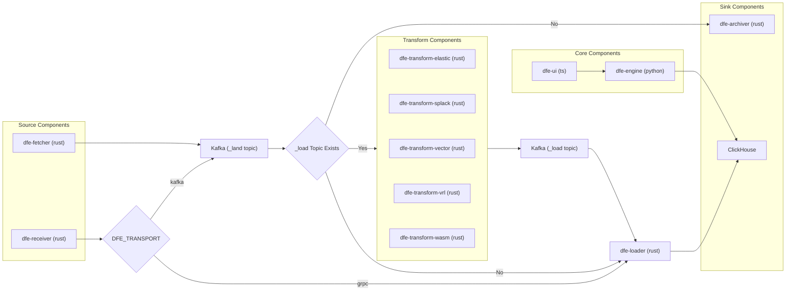

# DFE Docker - Project Scope

## Overview

DFE 2.2 defines two deployment modes for the Data Fusion Engine: a single-machine **Docker** deployment and a scalable **Kubernetes** deployment.

This repository (`dfe-docker`) implements the Docker deployment - a self-contained Docker Compose stack shipped as the `hyperi-dfe` package.

The Kubernetes deployment is a separate concern and is out of scope for this repository.

## Architecture

## Components

| Component                 | Internal/External | Description                   | Supports                                                                      |
|---------------------------|-------------------|-------------------------------|-------------------------------------------------------------------------------|
| **dfe-archiver**          | Internal          | Archive sink                  | filesystem, MinIO, S3, Azure Blob, GCS                                        |
| **dfe-engine**            | Internal          | Backend API for frontend      | -                                                                             |
| **dfe-fetcher**           | Internal          | Pulls events from APIs        | AWS, Azure, Microsoft 365, GCP, Vector.dev, container extractors, HTTP ingest |
| **dfe-loader**            | Internal          | Loads events into ClickHouse  | -                                                                             |
| **dfe-receiver**          | Internal          | Ingress                       | HTTP, gRPC/Vector, OTLP, Loki, Beats, Splunk HEC                              |
| **dfe-transform-elastic** | Internal          | Elastic Stack transform       | Beats, Elastic Agent, ECS, GeoIP                                              |
| **dfe-transform-splack**  | Internal          | Splunk-equivalent transform   | syslog, CEF, LEEF, Windows Event XML                                          |
| **dfe-transform-vector**  | Internal          | Vector.dev subprocess wrapper | lua, aggregate, dedupe, throttle, route                                       |
| **dfe-transform-vrl**     | Internal          | Embedded VRL engine           | -                                                                             |
| **dfe-transform-wasm**    | Internal          | WebAssembly transform host    | Rust, Go (TinyGo), AssemblyScript                                             |
| **dfe-ui**                | Internal          | Frontend                      | -                                                                             |
| **ClickHouse**            | External          | Columnar analytics store      | Docker container or external (e.g. ClickHouse Cloud)                          |
| **Kafka**                 | External          | Event streaming platform      | -                                                                             |

## Source Repositories

When running dfe-docker in `dev` mode, source repositories are required to be cloned under `$PROJECTS_PATH`:

| Repository                | Language   | Description                                                               |
|---------------------------|------------|---------------------------------------------------------------------------|
| **dfe-archiver**          | Rust       | Archive sink (filesystem, S3, MinIO, GCS, Azure Blob)                     |
| **dfe-engine**            | Python     | Backend API for frontend                                                  |
| **dfe-fetcher**           | Rust       | Cursor-based puller for AWS, Azure, M365, GCP audit/log APIs              |
| **dfe-loader**            | Rust       | ClickHouse loader                                                         |
| **dfe-receiver**          | Rust       | Event receiver / ingress (HTTP, gRPC/Vector, OTLP, Loki, Beats, HEC)      |
| **dfe-transform-elastic** | Rust       | Elastic Stack ingest pipeline transform (Beats, Agent, ECS, GeoIP)        |
| **dfe-transform-splack**  | Rust       | Splunk-equivalent transform (syslog, CEF, LEEF, Windows Event XML)        |
| **dfe-transform-vector**  | Rust       | Vector.dev subprocess wrapper for Kafka-to-Kafka transforms               |
| **dfe-transform-vrl**     | Rust       | Embedded VRL transform engine (no Vector subprocess)                      |
| **dfe-transform-wasm**    | Rust       | Wasmtime host for user-supplied WebAssembly transform modules             |
| **dfe-ui**                | TypeScript | Frontend                                                                  |

## Compiled Binaries and Artifacts

Rust components compile to native binaries with dfe-engine (Python) and dfe-ui (Node) shipping to their respective runtime images. These are then published to GHCR (ghcr.io/hyperi-io).

| Component                 | Image Status | Location                                |
|---------------------------|--------------|-----------------------------------------|
| **dfe-archiver**          | Published    | ghcr.io/hyperi-io/dfe-archiver          |
| **dfe-engine**            | Published    | ghcr.io/hyperi-io/dfe-engine            |
| **dfe-fetcher**           | Published    | ghcr.io/hyperi-io/dfe-fetcher           |
| **dfe-loader**            | Published    | ghcr.io/hyperi-io/dfe-loader            |
| **dfe-receiver**          | Published    | ghcr.io/hyperi-io/dfe-receiver          |
| **dfe-transform-elastic** | In Progress  | ghcr.io/hyperi-io/dfe-transform-elastic |
| **dfe-transform-splack**  | In Progress  | ghcr.io/hyperi-io/dfe-transform-splack  |
| **dfe-transform-vector**  | Published    | ghcr.io/hyperi-io/dfe-transform-vector  |
| **dfe-transform-vrl**     | Published    | ghcr.io/hyperi-io/dfe-transform-vrl     |
| **dfe-transform-wasm**    | In Progress  | ghcr.io/hyperi-io/dfe-transform-wasm    |
| **dfe-ui**                | In Progress  | ghcr.io/hyperi-io/dfe-ui                |
