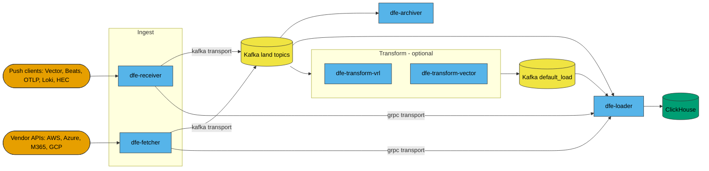
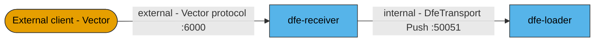
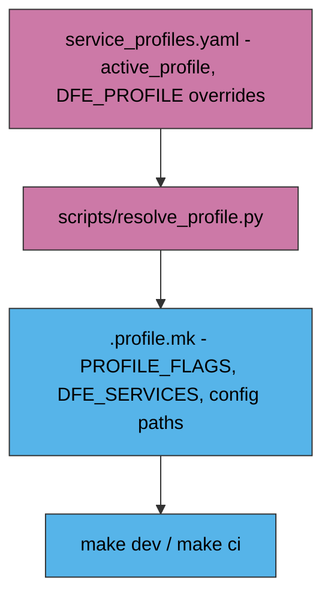

<!--
Project:   dfe-docker
File:      docs/architecture.md
Purpose:   How the DFE Compose stack fits together
Language:  Markdown

License:   BUSL-1.1
Copyright: (c) 2026 HYPERI PTY LIMITED
-->

# How the Compose stack fits together

This repo is **packaging, not product**. It ships a `docker-compose.yml`, the
config files the components mount, and Python helpers that resolve a profile and
pin image versions. It builds no production image and publishes nothing.

When something in the data path is wrong, the fix is almost always in a component
repo, not here.

## Events arrive two ways and leave one

Pushed to `dfe-receiver` or pulled by `dfe-fetcher`, and out through `dfe-loader`
into ClickHouse. Everything between is optional and profile-selected.

Transport is a per-profile choice, not a global one. On a `kafka-*` profile the
ingest components produce to a `*_land` topic derived from the event's `_source`,
and the loader consumes `topic_regex: .*_land`. On a `grpc-*` profile there is no
broker -- the ingest components dial `dfe-loader:50051` directly.

Both transforms and `dfe-archiver` are Kafka-only by construction: each reads a
topic and writes a topic or a volume. With a transform in the profile the loader
switches to `config/loader/kafka-load.yaml` and consumes `default_load` instead.

## The management plane rides alongside

Independent of transport, toggled as a unit by the `core` footprint key.

`dfe-proxy` exists to give the UI and the engine API one origin, because the UI
client calls the engine with a relative `/api/v1/...` base URL.

## Two ports speak gRPC and they are not the same thing

| Port | Owner | Protocol | Audience | Binds |
|---|---|---|---|---|
| 6000 | dfe-receiver | Vector protocol, an ingest source | external clients | `DFE_INGRESS_BIND_HOST` (`0.0.0.0`) |
| 50051 | dfe-loader | `DfeTransport/Push`, internal transport | receiver, fetcher | `DFE_BIND_HOST` (`127.0.0.1`) |

The binding split is the tell: 6000 is meant to be reachable, 50051 is not.

## Two independent selectors decide what runs

Compose profiles select INFRASTRUCTURE. `service_profiles.yaml` selects DFE
SERVICES. `scripts/resolve_profile.py` reads the second and derives the first,
writing `.profile.mk` for the Makefile.

| Compose profile | Services |
|---|---|
| `clickhouse` | `clickhouse` |
| `kafka-redpanda` | `kafka-redpanda`, `kafka-init-redpanda` |
| `kafka-apache` | `kafka-apache`, `kafka-init-apache` |
| `kafka-ui` | `kafka-ui` (Kafbat) |
| `dfe` | `dlq-init`, archiver, fetcher, loader, receiver, both transforms |
| `core` | `dfe-engine`, `dfe-ui`, `dfe-proxy` |
| `hyperdx` | `hyperdx`, `hyperdx-ferretdb`, `hyperdx-postgres` |
| `otel` | `otel-collector` |

A profile declares its whole footprint through the optional `clickhouse`, `core`,
`kafbat`, `hyperdx` and `otel` keys, each overridable by the matching `.env` flag.
Each service entry also names the config file it mounts, which is how one service
gets a Kafka config and another a gRPC one without a second compose file.

## dfe-engine owns the schema

Nothing here provisions a ClickHouse table. `dfe-engine` ships `/app/schemas`
inside its own image, creates the ClickHouse objects at startup, and registers the
schemas `dfe-loader` pre-warms into its cache. A loader started before the engine
is healthy holds messages pending-schema and dead-letters them, which is why the
e2e harness gates on engine health before any DFE service.

`dfe-schemas` rides inside the engine image, so there is no separate schema pin
here and a schema change is a `dfe-engine` release. The only file the ClickHouse
service mounts is `clickhouse/default-user.xml`; a DDL file appearing in this repo
is wrong by construction.

## The Kafka backend is swappable

Two brokers, mutually exclusive, chosen by `KAFKA_BACKEND` (`redpanda` default,
`apache` opt-in). Both expose the network alias `kafka` on the same ports, so
every config addresses `kafka:9092` and nothing downstream knows which is running.

Each backend has its OWN topic-init using its own tooling, so choosing Apache to
stay clear of the BSL never pulls a BSL artefact. Compose interpolates every
service before profiles filter anything, so `REDPANDA_VERSION` must still be
pinned for the file to resolve on the Apache path -- a pin is not a deployment,
but it is a remaining reference.

## Component source repos

Dev builds fetch source into a managed git cache, or from your own checkouts when
`DFE_SRC_ROOT` is set -- see
[developing.md](developing.md#where-it-looks-for-your-source).

| Repo | Language | Role | Profile |
|---|---|---|---|
| `dfe-receiver` | Rust | Push ingest; HTTP `:8080` and Vector gRPC `:6000` published, OTLP/Beats/HEC commented out | `dfe` |
| `dfe-fetcher` | Rust | Pull ingest from vendor APIs | `dfe` |
| `dfe-loader` | Rust | Writes ClickHouse; hosts `DfeTransport/Push` | `dfe` |
| `dfe-archiver` | Rust | Archive sink (filesystem, S3, MinIO, GCS, Azure Blob) | `dfe` |
| `dfe-transform-vector` | Rust | Vector.dev subprocess wrapper, Kafka to Kafka | `dfe` |
| `dfe-transform-vrl` | Rust | Embedded VRL transform engine | `dfe` |
| `dfe-engine` | Python | Config and schema API; the schema authority | `core` |
| `dfe-ui` | TypeScript | Web console | `core` |
| `dfe-hyperdx` | TypeScript | HyperDX fork. Repo and published image are both `dfe-hyperdx` | `hyperdx` |

`dfe-transform-elastic`, `dfe-transform-splack` and `dfe-transform-wasm` have
repos but no service here, so this stack cannot run them.

## Where this differs from Kubernetes

Kubernetes is the primary DFE path. Compose is supported for small environments
and is not co-equal -- if both would work, choose Kubernetes. What makes Compose
safe to deploy is that it consumes the SAME image from the SAME registry, pinned
from the same stack SSoT, so both run identical digests.

Two deliberate asymmetries:

- **No authentication.** Compose runs god-mode. Envoy fronts both tiers, but its
  OIDC filters stay unconfigured here, because Docker mode can never assume an
  issuer exists. An OIDC issuer (the engine as provider, or an external IdP)
  would front the proxy origin only, leaving ingest, machine paths, metrics and
  datastores untouched.
- **Self-monitoring has fewer producers.** Same chain, fewer things pushing into
  it, and no container logs or node metrics -- those come from a daemonset on the
  cluster. See [observability.md](observability.md).

## Related

- [operating.md](operating.md) -- exposure, limits, secrets, persistence
- [deploying.md](deploying.md) -- the dial, pinning, upgrades
- [observability.md](observability.md) -- health, self-telemetry, the self test
- [developing.md](developing.md) -- dev mode, profiles, proving the pipeline
