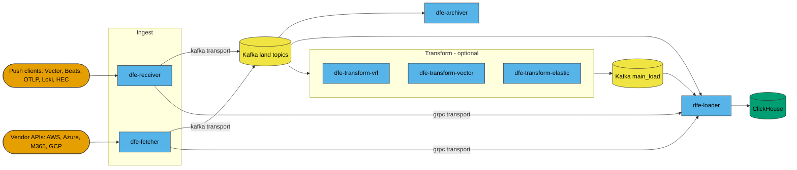
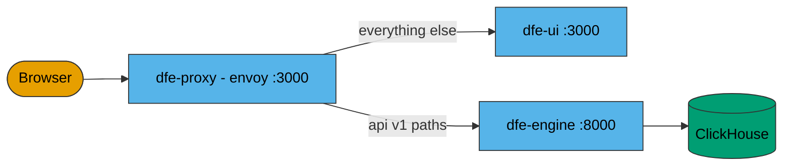
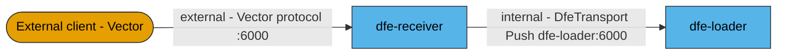
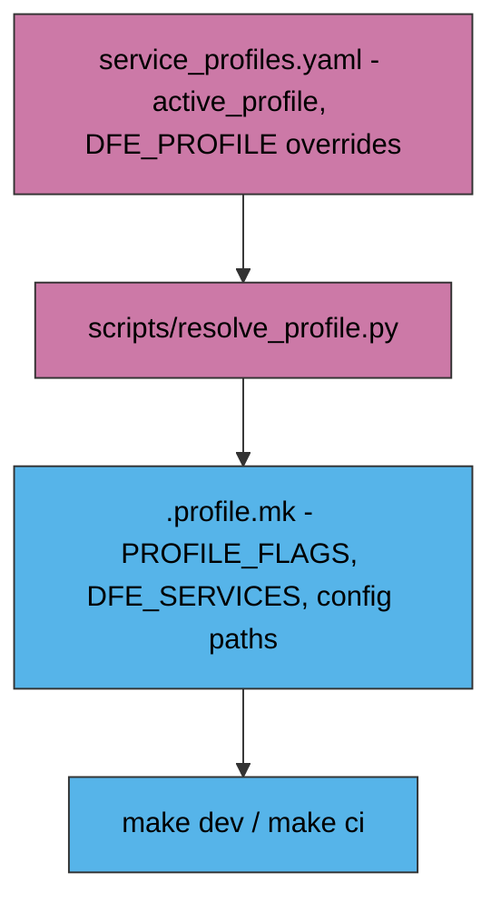

<!--
Project:   dfe-docker
File:      docs/architecture.md
Purpose:   How the DFE Compose stack fits together
Language:  Markdown

License:   BUSL-1.1
Copyright: (c) 2026 HYPERI PTY LIMITED
-->

# How the Compose stack fits together

This repo is **packaging, not product**. It ships a `docker-compose.yml`, the
config files the components mount, and Python helpers that resolve a profile and
pin image versions. It builds no production image and publishes nothing.

When something in the data path is wrong, the fix is almost always in a component
repo, not here.

## Events arrive two ways and leave one

Pushed to `dfe-receiver` or pulled by `dfe-fetcher`, and out through `dfe-loader`
into ClickHouse. Everything between is optional and profile-selected.

Transport is a per-profile choice, not a global one. On a `kafka-*` profile the
ingest components produce to a `*_land` topic derived from the event's `_source`,
and the loader consumes `topic_regex: .*_land`. On a `grpc-*` profile there is no
broker -- the ingest components dial `dfe-loader:6000` directly.

The three transforms are bus-only today: each reads a topic and writes a topic.
`dfe-archiver` runs on either -- it consumes the landing topics on Kafka and
answers a scalo Push listener on gRPC (`config/archiver/grpc.yaml`). With a
transform in the profile the loader switches to `config/loader/kafka-load.yaml`
and consumes `main_load`.

## What each tier runs, and what starts with nothing to do

`slim` is the core data path alone: receiver, loader, engine, UI and HyperDX.
`single` adds the broker and four more apps -- one archiver, one fetcher, one
transform-vrl, one transform-elastic -- each started from a config that gives it
no work.

An idle app is Ready, serves health and metrics, opens no broker connection and
holds `pipeline_idle` at 1, so being deployed unconfigured costs a container and
nothing else. It is there because Compose declares its services in this repo and
creates none at run time: an app that cannot be added later has to be present
before anything needs it.

They stay inert until something gives them work, and on these two tiers that is a
source created through the engine.

## The engine renders each app's config on the projected tiers

On Kubernetes an app's chart turns its values overlay into a ConfigMap the pod
mounts. Compose runs no chart, so on `slim` and `single` dfe-engine does that
step: it merges each instance's overlay over the committed
`config/<app>/<transport>.yaml` and writes the app's config file, its programs
and its enrichment tables into the `dfe-app-config` volume, one directory per
app. Every app mounts that volume read-only at `/etc/dfe/apps`.

The committed file stays the DEPLOYMENT's -- brokers, warehouse credentials, the
spool -- and the overlay wins wherever the two name the same key, so nothing
deployment-specific is written into the deploy repo. `resolve_profile.py` turns
this on for the projected tiers only: every other profile ships the config it
exists to exercise.

Nothing restarts a container. A change the running app cannot take in place is
reported by the API as `restart required: docker compose restart <app>`; an app
that was IDLE needs no restart, because scalo's gate re-reads the file and starts
the service on the spot.

## A source with its own transform gets its own instance

A source with a transform stops sharing `main_land`: the receiver routes it to
`<source>_land`, and only a transform reading THAT topic sees it. So a transform
is deployed once per source, as the Kubernetes tier deploys one per Source
definition -- input topic, program directory and output topic all carry the name.

Two shipped examples, one per transform app, and the shape another source copies.
All eleven pieces are needed: the first five carry the data, the rest keep dev
mode, profile resolution and the checks working.

| Piece | `kafka-filebeat`, on dfe-transform-vrl | `kafka-filebeat-vector`, on dfe-transform-vector |
|---|---|---|
| Compose service | `dfe-transform-vrl-filebeat`, the same image, its own metrics port | `dfe-transform-vector-filebeat`, likewise |
| Config | `config/transform-vrl/filebeat.yaml` -- `filebeat_land` in, `filebeat_load` out | `config/transform-vector/filebeat.yaml` -- `dfe_source: filebeat-vector` derives both topics |
| Program | `config/transform-vrl/transforms-filebeat/`, vendored from dfe-transform-vrl | `config/transform-vector/transforms-filebeat/`, the same VRL inside a Vector `remap`, vendored from dfe-transform-vector |
| Loader | `config/loader/kafka-load-filebeat.yaml` lists `filebeat_load` alongside `main_load` | `config/loader/kafka-load-filebeat-vector.yaml` lists `filebeat-vector_load` |
| Table | `dfe.filebeat`, from the `_load` topic name -- the loader strips the suffix and routes on it | ``dfe.`filebeat-vector` ``, the same way |
| Enrichment data | `config/transform-vrl/data/`, mounted beside the program dir -- the transform scans that dir for programs | the same directory, mounted at `/etc/dfe-transform-vector/data` -- one table, not a copy per app |
| Dev images | an override block plus `IMAGE_CONSUMERS` in `scripts/build_dev_images.py`, or `make dev` leaves it on the registry pin | the same |
| Env file | `env.example/transform-vrl-filebeat.env` for its own overrides; `make init` copies it into `env/` | `env.example/transform-vector-filebeat.env` |
| Profile resolution | `SERVICES` and `SERVICE_TO_CONFIG_VAR` in `scripts/resolve_profile.py`, so a profile can run it without the passthrough instance | the same |
| Check coverage | `_DFE_OWNED_SERVICES` in `scripts/check_compose.py`, which holds it to the `/livez` health surface | the same |
| Metrics ports | a free host port (`DFE_TRANSFORM_VRL_FILEBEAT_PROMETHEUS_PORT`, 9097): every instance serves 9090 and two cannot publish one | the same (`DFE_TRANSFORM_VECTOR_FILEBEAT_PROMETHEUS_PORT`, 9098) |

One port carries everything. The wrapper scrapes Vector's `internal_metrics` off
its `prometheus_exporter` on loopback and registers the samples on scalo's own
recorder (dfe-transform-vector#70), so `vector_*` reads on the published port AND
rides the OTLP push into the otel database. The exporter's 9598 is not published.

The two profiles are deliberately disjoint -- own source name, own topics, own
table -- so a deployment can run both and compare what the two transform apps
make of one corpus.

`kafka-elastic-cisco-ios` is the same shape on `dfe-transform-elastic`, minus
the program and enrichment rows: that app compiles its transforms in and names
one per instance in `source.name`, so there is nothing to vendor and nothing to
mount. Its source is `cisco-ios` rather than `filebeat` because
`filebeat.cisco_ios.default` is one data stream, not an umbrella program. It
also runs one instance rather than two -- there is no passthrough variant to
pair it with, so the loader reads `main_land` itself through its `topic_regex`.

Both tables are dfe-engine's to create from the `meta/beats/filebeat` meta
schema -- nothing here provisions them. Create the source before sending it
data: a loader that meets rows for a table it has no schema for buffers them,
then dead-letters them.

The source NAME propagates character for character: the engine requires a
Kubernetes DNS-1123 label (hyphens, never underscores, because a source-bound
app deploys one instance named for its source), the receiver substitutes it into
`<_source>_land`, and the loader strips `_load` back off for the table. So
`filebeat-vector` gives `filebeat-vector_land`, `filebeat-vector_load` and a
table name that needs backticks in SQL.

`make check` asserts the wiring: a transform whose output topic no loader in the
profile reads fails, as does an enrichment table no mount resolves.

## The management plane rides alongside

Independent of transport, toggled as a unit by the `core` footprint key.

`dfe-proxy` exists to give the UI and the engine API one origin, because the UI
client calls the engine with a relative `/api/v1/...` base URL.

## Two gRPC listeners speak different protocols

Both listen on 6000 inside their own container. The host ports differ because both are published.

| Container port | Host port | Owner | Protocol | Audience | Binds |
|---|---|---|---|---|---|
| 6000 | 6000 | dfe-receiver | Vector protocol, an ingest source | external clients | `DFE_INGRESS_BIND_HOST` (`0.0.0.0`) |
| 6000 | 50051 | dfe-loader | `DfeTransport/Push`, internal transport | receiver, fetcher, transforms | `DFE_BIND_HOST` (`127.0.0.1`) |

The binding split is the tell: the receiver's 6000 is meant to be reachable, the loader's is not. The loader's 6000 is the `push` port dfe-infra's `apps.yaml` declares, and dfe-engine refuses a loader `grpc.listen` on any other.

## Two independent selectors decide what runs

Compose profiles select INFRASTRUCTURE. `service_profiles.yaml` selects DFE
SERVICES. `scripts/resolve_profile.py` reads the second and derives the first,
writing `.profile.mk` for the Makefile.

| Compose profile | Services |
|---|---|
| `clickhouse` | `clickhouse` |
| `kafka-redpanda` | `kafka-redpanda` |
| `kafka-apache` | `kafka-apache` |
| `kafka-ui` | `kafka-ui` (Kafbat) |
| `dfe` | `dlq-init`, archiver, fetcher, loader, receiver, every transform instance |
| `core` | `dfe-engine`, `dfe-ui`, `dfe-proxy` |
| `hyperdx` | `hyperdx`, `hyperdx-ferretdb`, `hyperdx-postgres` |
| `otel` | `otel-collector` |

A profile declares its whole footprint through the optional `clickhouse`, `core`,
`kafbat`, `hyperdx` and `otel` keys, each overridable by the matching `.env` flag.
Each service entry also names the config file it mounts, which is how one service
gets a Kafka config and another a gRPC one without a second compose file.

## dfe-engine owns the schema and the topics

Nothing here provisions a ClickHouse table or a Kafka topic. `dfe-engine` ships
`/app/schemas` inside its own image, applies every object and every bootstrap
topic from that manifest at startup, and reports healthy only once that pass
converged. Every service that reads one waits on
`depends_on: dfe-engine: service_healthy` -- a loader started first holds messages
pending-schema and dead-letters them, which reads as data loss and is really start
ordering.

`dfe-schemas` rides inside the engine image, so there is no separate schema pin
here and a schema change is a `dfe-engine` release. The only file the ClickHouse
service mounts is `clickhouse/default-user.xml`; a DDL file or a topic-creating
step appearing in this repo is wrong by construction, and
`scripts/tests/test_engine_only_schema_control.py` fails the build on one.

## The Kafka backend is swappable

Two brokers, mutually exclusive, chosen by `KAFKA_BACKEND` (`redpanda` default,
`apache` opt-in). Both expose the network alias `kafka` on the same ports, so
every config addresses `kafka:9092` and nothing downstream knows which is running.

Compose interpolates every service before profiles filter anything, so
`REDPANDA_VERSION` must still be pinned for the file to resolve on the Apache
path -- a pin is not a deployment, but it is a remaining reference.

## Component source repos

Dev builds fetch source into a managed git cache, or from your own checkouts when
`DFE_SRC_ROOT` is set -- see
[developing.md](developing.md#where-it-looks-for-your-source).

| Repo | Language | Role | Profile |
|---|---|---|---|
| `dfe-receiver` | Rust | Push ingest; HTTP `:8080` and Vector gRPC `:6000` published, OTLP/Beats/HEC commented out | `dfe` |
| `dfe-fetcher` | Rust | Pull ingest from vendor APIs | `dfe` |
| `dfe-loader` | Rust | Writes ClickHouse; hosts `DfeTransport/Push` | `dfe` |
| `dfe-archiver` | Rust | Archive sink (filesystem, S3, MinIO, GCS, Azure Blob) | `dfe` |
| `dfe-transform-elastic` | Rust | Beats and Elastic Agent pipelines compiled to Rust, one transform selected per instance by `source.name` | `dfe` |
| `dfe-transform-vector` | Rust | Vector.dev subprocess wrapper, Kafka to Kafka | `dfe` |
| `dfe-transform-vrl` | Rust | Embedded VRL transform engine; deployed once per source that has a transform | `dfe` |
| `dfe-engine` | Python | Config and schema API; the schema authority | `core` |
| `dfe-ui` | TypeScript | Web console | `core` |
| `dfe-hyperdx` | TypeScript | HyperDX fork. Repo and published image are both `dfe-hyperdx` | `hyperdx` |

`dfe-transform-splack` and `dfe-transform-wasm` have repos but no service here,
so this stack cannot run them.

## Where this differs from Kubernetes

Kubernetes is the primary DFE path. Compose is supported for small environments
and is not co-equal -- if both would work, choose Kubernetes. What makes Compose
safe to deploy is that it consumes the SAME image from the SAME registry, pinned
from the same stack SSoT, so both run identical digests.

Three deliberate asymmetries:

- **One of each app.** Kubernetes deploys a fetcher and a transform per source
  and the engine writes each instance; Compose declares its services here and
  creates none at run time, so `single` starts one of each idle instead and a
  second source of either kind needs Kubernetes.
- **No authentication.** Compose runs god-mode. Envoy fronts both tiers, but its
  OIDC filters stay unconfigured here, because Docker mode can never assume an
  issuer exists. An OIDC issuer (the engine as provider, or an external IdP)
  would front the proxy origin only, leaving ingest, machine paths, metrics and
  datastores untouched.
- **Self-monitoring has fewer producers.** Same chain, fewer things pushing into
  it, and no container logs or node metrics -- those come from a daemonset on the
  cluster. See [observability.md](observability.md).

## Related

- [operating.md](operating.md) -- exposure, limits, secrets, persistence
- [deploying.md](deploying.md) -- the dial, pinning, upgrades
- [observability.md](observability.md) -- health, self-telemetry, the self test
- [developing.md](developing.md) -- dev mode, profiles, proving the pipeline
