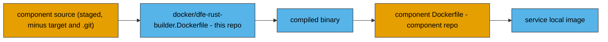

<!--
Project:   dfe-docker
File:      docs/developing.md
Purpose:   Using the Compose stack as a local test rig for DFE component work
Language:  Markdown

License:   BUSL-1.1
Copyright: (c) 2026 HYPERI PTY LIMITED
-->

# Developing against the stack

This applies to you if you are working on a DFE component and need a stack to
test it against.

You do not develop *this* repo to change component behaviour -- it is packaging.
What you get from it is a running pipeline that either pulls published images or
compiles your local component source, plus two harnesses that prove events
actually traverse it.

Read [ARCHITECTURE.md](../ARCHITECTURE.md) first if you have not: which services
exist, and how a profile decides which of them run.

## Prerequisites

| Need | For |
|---|---|
| Docker and Docker Compose v2 | everything |
| Python 3 | the helper scripts under `scripts/` |
| PyYAML | `make test-e2e` only (`pip install pyyaml`, or `uv run --with pyyaml`) |
| ruff | `make check-python` only |
| git credentials for the hyperi-io repos (or `DFE_SRC_ROOT` checkouts) | `make dev` |

## First run

```bash
make init                  # generate .env and env/<service>.env
make stack VERSION=X.Y.Z   # pin the image versions
make ci                    # pull and start, then run the self test
```

`make init` copies `.env.example` to `.env` and every `env.example/<service>.env`
to `env/<service>.env`. Existing files are never overwritten, so it is safe to
re-run. It does two things beyond the copy:

- **Generates secrets.** `DFE_UI_NEXTAUTH_SECRET` and `HYPERDX_POSTGRES_PASSWORD`
  get a random value. An existing `.env` that predates a key is topped up.
- **Reports drift.** The copy is one-shot, so a `.env` made months ago never
  learns that `.env.example` grew a setting. A re-run lists the keys yours is
  missing and stops there -- editing your `.env` is yours to do.

`make stack VERSION=X.Y.Z[-rc.N]` writes the `*_VERSION` pins into `.env` from the
DFE stack SSoT. It uses a local dfe-infra checkout only when `DFE_INFRA_DIR`
names one (`scripts/dfe-stack render --target docker --stack VERSION`), and
otherwise does an `oras pull` of `ghcr.io/hyperi-io/dfe-stack-manifest:VERSION`.
If neither is available it fails loudly -- there is no silent `latest`. Only
`*_VERSION` keys are rewritten; your ports, hosts, credentials and profile
survive the merge.

Skipping `make stack` is not a soft failure. Nearly every image pin uses
`${VAR:?...}`, so an unpinned checkout aborts the compose command with a message
naming the key.

## Dev mode compiles your source; registry mode pulls GHCR

```bash
make dev    # build :local images from local component source, then start
make ci     # pull the pinned GHCR images, then start
```

`make dev` relies on `docker-compose.override.yml`, which is committed and
auto-loaded by Compose with no flags. It repoints each DFE service at
`<service>:local`. `make ci` passes `-f docker-compose.yml` explicitly, which
skips the override and therefore uses registry images only.

`scripts/build_dev_images.py` builds the `:local` images in two stages for every
Rust component:



**This repo owns the build; the component owns the runtime.** The shared builder
image is where the toolchain, the Confluent `librdkafka-dev` and the pinned Rust
version live, so every component compiles the same way. Packaging then goes
through the component's own committed `Dockerfile` with the binary in context, so
the runtime image you test is the one the component ships.

`dfe-engine`, `dfe-ui` and `hyperdx` skip the builder entirely and build straight
from their own Dockerfile.

A service that is not a locally buildable DFE component (ClickHouse, the broker,
`kafka-ui`) is skipped with a message rather than failing the build.

### Where it looks for your source

Source comes via git, never an assumed directory layout:

- **Default -- the managed cache.** The builder clones each component repo from
  `DFE_SRC_REMOTE` (default `https://github.com/hyperi-io`) into
  `DFE_SRC_CACHE` (default `~/.cache/dfe-docker/src`) and builds the commit
  `DFE_SRC_REF` resolves to (default `main`). Re-runs fetch and re-checkout, so
  the cache tracks the ref. The cache is tool-managed: a dirty checkout there
  fails the build rather than silently building someone's stray edits.
- **Local work -- set `DFE_SRC_ROOT`.** Point it at the directory holding your
  `dfe-*` checkouts (in `.env` or the `make` command line) and the builder uses
  those working trees as they stand, uncommitted changes included. This is the
  explicit replacement for the old sibling-checkout assumption -- nothing is
  inferred from where this repo happens to live.
- **Live engine edits -- `make dev LIVE=1`.** Layers `docker-compose.live.yml`,
  which bind-mounts `dfe-engine/config` and `dfe-engine/schemas` from
  `DFE_SRC_ROOT` so engine config edits land without a rebuild. It hard-fails
  when `DFE_SRC_ROOT` is unset, because a defaulted path would silently mount
  empty directories over the engine's own config on any machine without that
  layout. Note that with `DFE_SRC_ROOT` set, EVERY active component builds from
  those checkouts -- live mode is "build and mount my local source", not an
  engine-only switch.

`make stack`'s local-render path is explicit the same way: it uses a dfe-infra
checkout only when `DFE_INFRA_DIR` names one, and otherwise pulls the signed OCI
stack manifest.

## Picking a profile

`service_profiles.yaml` decides which DFE services run and which config each
mounts. `active_profile` is the default; `DFE_PROFILE` overrides it for one
invocation.

Two profiles name a whole-stack shape and share their names with the Kubernetes
tier, so one deployment dial reads the same on both:

| Profile | Transport | Services | Also starts |
|---|---|---|---|
| `slim` | grpc | loader, receiver | ClickHouse, core |
| `single` | kafka | archiver, fetcher, loader, receiver, transform-vrl | ClickHouse, core, kafka-ui |

`single` is the complete stack -- it is what "everything on one box" means here,
and the only shape the bundled dex profile will front when it lands. HyperDX
stays opt-in on it, matching the Kubernetes profile. There is no `scale`:
Compose cannot run an HA broker or a ClickHouse cluster.

The rest are fine-grained data-plane shapes. The e2e suite pins them by name.

| Profile | Transport | Services |
|---|---|---|
| `kafka-minimal` | kafka | loader |
| `kafka-fetcher` | kafka | fetcher, loader |
| `kafka-receiver` | kafka | loader, receiver |
| `kafka-receiver-archiver` | kafka | archiver, loader, receiver |
| `kafka-receiver-transform-vector` | kafka | loader, receiver, transform-vector |
| `kafka-full` | kafka | archiver, fetcher, loader, receiver |
| `kafka-full-transform-vrl` | kafka | fetcher, loader, receiver, transform-vrl |
| `grpc-minimal` | grpc | loader |
| `grpc-fetcher` | grpc | fetcher, loader |
| `grpc-receiver` | grpc | loader, receiver |
| `grpc-full` | grpc | fetcher, loader, receiver |

```bash
DFE_PROFILE=grpc-full make dev        # override the profile
KAFKA_BACKEND=apache make dev         # Apache Kafka instead of Redpanda
DFE_CORE_ENABLED=false make dev       # skip engine, UI and proxy
DFE_CLICKHOUSE_ENABLED=false make dev # no warehouse container (external instance)
DFE_HYPERDX_ENABLED=1 make dev        # add the HyperDX observability stack
make dev SERVICES="dfe-loader"        # start a subset of the resolved profile
```

Those four flags mirror the `clickhouse`, `core`, `kafbat` and `hyperdx` keys a
profile may declare, and they win over it -- `.env` is what a deploy writes, the
profile is the committed shape. Leave them unset and the profile decides.

Two of those need a warning.

`DFE_CORE_ENABLED=false` drops `dfe-engine`, and **dfe-engine is the schema
authority** -- nothing else provisions the ClickHouse tables or registers the
schemas the loader pre-warms. Without it the loader holds messages pending-schema
and dead-letters them, so the data path looks broken when it is really unprovisioned.
Use it when you are working on the UI or proxy against tables that already exist,
not on a fresh stack.

`make dev SERVICES="..."` no longer starts a subset on top of a running stack:
`dev` depends on `down`, which now tears down every profile first.

A name in `SERVICES` that is not part of the resolved stack is a hard error, not a
silent no-op. Adding a config to a profile that does not exist on disk is caught
too -- `resolve_profile.py` validates every `config_path` before writing
`.profile.mk`.

## Proving the pipeline works

Two harnesses, different scopes. Both inject uniquely marked events and read the
marker back out of ClickHouse, so neither can pass on a stack that started but
does not move data.

### Power-on self test -- runs whether you ask or not

`make dev` and `make ci` finish by running `scripts/post.py`. It injects three
marked events at the ingest edge of the **resolved profile** (receiver if the
profile has one, otherwise fetcher) and waits for those exact rows in
`dfe.default`.

```bash
make post                        # against an already-running stack
DFE_POST_ENABLED=false make ci   # opt out
```

What a pass proves: an event put in one end came out the other, on whichever
transport is active. What it also catches: a secret still sitting at its committed
default -- it fails before injecting anything and tells you to run `make init`.

Two honest limits. On a loader-only profile it **skips** with a stated reason,
because there is no ingest edge. And if rows arrive but no marker can be read, it
**fails** rather than claiming success -- a schema without `_tags` makes the check
unverifiable, which is not the same as passing.

### End-to-end suite -- one stack per test

```bash
make test-e2e
make test-e2e E2E_TESTS="simple-receiver-to-loader-grpc simple-fetcher-to-loader"
```

`tests/e2e/e2e-tests.yaml` is the definition. A `global:` block sets the data file
(`tests/e2e/data/events.jsonl`), the mode (`ci` builds `--no-cache --pull`; `dev`
also loads the override file) and `persistent_services` -- only ClickHouse
survives between tests, so each test runs its own config against a fresh broker.
Each entry under `tests:` names a `service_profiles.yaml` profile, optionally
`expected_topics` (created and cleaned per run, then verified) and
`config_overrides` keyed by service name.

The runner brings ClickHouse and `dfe-engine` up first and gates on the engine's
health, because the engine provisions `dfe.default` and registers the schemas the
loader pre-warms. Then it asserts **two** things per test: the row-count delta
from a per-test baseline, and that those rows carry this run's marker in `_tags`.
The delta alone would pass on somebody else's rows; the marker alone would not
notice a partial load. A marker column it cannot locate is reported, never
silently treated as a pass.

A profile declaring `otel` adds a third assertion -- the stack's own telemetry
landing fresh in the `otel` database -- and `expected_http` adds a fourth, a
status and optional body check per URL. `single` uses both, which is what makes
`complete-single-node-stack` a whole-stack test rather than a data-path one.

Two things about the runner worth knowing before you debug it:

- **It waits on named services, never on a whole profile.** `docker compose up
  --wait` treats a container that EXITS as a failure even on exit 0, and the
  topic-init services are one-shots that are supposed to exit. Waiting on the
  profile swept them in and failed every time, regardless of the broker. That was
  silently breaking the default Redpanda backend -- `rpk` finishes in about a
  second, so init had always exited by the time `--wait` looked -- while the
  Apache backend passed on luck, `kafka-topics.sh` being slow enough to still be
  running. A test that passes on timing is not passing.
- **It deletes the `_load` sibling of every expected `_land` topic before each
  run.** Broker volumes outlive containers, so one earlier transform run leaves
  `default_load` on the broker forever, and scalo's suppression rule then drops
  `default_land` from every non-transform loader's subscription. See
  [troubleshooting.md](troubleshooting.md#configloaderkafka-loadyaml-consumes-a-topic-nothing-pre-creates).
  Deleting it per run means a run depends on the test definition rather than on
  broker history.

## Static checks

`make check` runs what CI runs, so a green local run means a green pipeline.

| Target | What it does |
|---|---|
| `make check-compose` | `docker compose config` on the registry and dev paths, against both Kafka backends, plus the CPU floor assertion |
| `make check-hardfail` | asserts an unpinned checkout refuses to resolve instead of pulling `latest` |
| `make check-dockerfile` | hadolint on `docker/dfe-rust-builder.Dockerfile` |
| `make check-docs` | asserts every relative link across the README and the five docs resolves |
| `make check-python` | `ruff check` and `ruff format --check` on `scripts/` |

`check-compose` is hermetic: it reads the mandatory `${VAR:?}` keys out of the
compose file and substitutes placeholders, so it needs neither the stack SSoT nor
registry credentials. It validates compose *structure*, not that any digest
resolves. It also refuses a `DFE_SERVICE_CPUS` under 2.0 on any service that gates
on `/readyz` -- see [operating.md](operating.md#dfe_service_cpus-has-a-floor-of-20-and-it-is-not-about-speed)
for why a lower ceiling takes health endpoints dark.

`check-docs` resolves the file half of every relative link; it does not fetch
external URLs and does not check `#anchors`, so a live file with a stale anchor
still passes.

`check-dockerfile` pulls the pinned hadolint image, so it wants a registry the
first time. The rest need no network.

## Port collisions on a shared dev host

The broker publishes to host ports `9092` and `19092`. A shared dev box very often
already runs a Kafka or Redpanda on `9092`.

```bash
make test-e2e KAFKA_PLAINTEXT_PORT=29092 KAFKA_PLAINTEXT_HOST_PORT=29192
```

Nothing inside the stack cares: every service and config addresses the broker over
the Docker network alias `kafka:9092`, and the host publish is only for tools you
run outside the containers. If you would rather avoid the broker altogether, the
gRPC tests need none:

```bash
make test-e2e E2E_TESTS="simple-receiver-to-loader-grpc simple-fetcher-to-loader"
```

The same reasoning applies to ClickHouse (`CLICKHOUSE_HTTP_PORT`,
`CLICKHOUSE_NATIVE_PORT`) and every `*_PROMETHEUS_PORT`.

## Sharp edges

**`make down` tears down every profile, not just the active one.** It runs
`docker compose -f docker-compose.yml --profile "*" down --remove-orphans`, and
keeps volumes. That is a change: it used to be profile-scoped, so switching from
`kafka-receiver` to `kafka-fetcher` left the old receiver running and answering on
`:8080`. That stray is exactly why the self test asks the resolved profile what
should be there instead of probing ports.

The consequence to know: because `make dev` and `make ci` depend on `down`, a
`make dev SERVICES="dfe-loader"` no longer restarts just that service on top of a
running stack -- everything is stopped first.

**`.env` shadows a command-line environment variable through make.** The Makefile
does `-include .env`, and GNU make re-exports a variable that came from the
environment using the *makefile's* value. So with `DFE_PROFILE` set in `.env`,
`DFE_PROFILE=grpc-full make dev` silently uses the `.env` value. Verified on this
repo's shape with a minimal reproduction. If an override appears to do nothing,
check `.env` first; comment the key out there, or use `make -e`.

**Compose `environment:` beats `env/<service>.env`.** A key listed in a service's
`environment:` block in `docker-compose.yml` wins over the same key in the
per-service env file. `LOG_LEVEL` is forwarded by compose, so setting it in
`env/receiver.env` does nothing; a key compose does not forward reaches the
container fine.

**A build failure in dev mode is usually a component-repo problem.** The builder
compiles from staged source with no `target/` -- it uses a cache mount rather than
your local build artefacts, so a first build after a toolchain change is slow, and
a compile error is yours, not the harness's.
