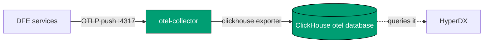

<!--
Project:   dfe-docker
File:      docs/observability.md
Purpose:   How the stack reports on itself, and what each surface proves
Language:  Markdown

License:   BUSL-1.1
Copyright: (c) 2026 HYPERI PTY LIMITED
-->

# How the stack reports on itself

Three surfaces, three different questions. Reaching for the wrong one is the
usual reason a stack looks fine while something is quietly broken.

| Surface | Answers | Where |
|---|---|---|
| Health endpoints | is this process alive, can it work right now | `/livez`, `/readyz` |
| Self-telemetry | what has the stack been doing | the `otel` ClickHouse database |
| The self test | did an event actually get through | `make post` |

Ingested data is a different question -- [troubleshooting.md](troubleshooting.md).

## The health surface is three paths, with no aliases

Every DFE service serves `/livez`, `/readyz` and `/metrics` on its observability
port. Nothing else. `/healthz` and the `/health/*` paths are retired and **404 on
every image pinned here**, so a probe aimed at one reads as a service that never
came up. That is how a pinned dfe-engine once sat in a restart loop.

`make check-compose` rejects any healthcheck on a retired path, so it cannot come
back by accident.

| Service | Host port | Notes |
|---|---|---|
| dfe-receiver / loader / archiver / fetcher / transforms | 9090, 9091, 9093-9096 | all three paths |
| dfe-engine | 8003 | `/metrics` is on its container's own 9090, unpublished |
| dfe-ui | none | all three on `:3000`, alongside the app |
| dfe-proxy | 3000 | `/livez`, answered by Envoy itself |
| otel-collector | 13133 | the `health_check` extension |
| hyperdx | 8000 | `/health` -- third party, its own convention |

These bind `DFE_BIND_HOST` (`127.0.0.1`), so curl them from the box, not your
laptop.

**dfe-ui has a trap.** Its three paths are real, but an UNKNOWN path returns the
200 app shell rather than a 404, because Next.js routes anything it does not
recognise to the page. A probe aimed at a typo passes. `/api/livez` is one.

## Compose picks liveness or readiness for you

Compose has no readiness condition. `depends_on: service_healthy` is the only
startup gate, so anything others wait on must report READINESS or the gate is
decorative.

| Service | Path | Why |
|---|---|---|
| dfe-loader | `/readyz` | receiver and fetcher wait on it |
| dfe-engine | `/readyz` | loader and proxy wait on it, and it provisions their schema |
| everything else | `/livez` | nothing gates on them |
| otel-collector | none | distroless, so nothing inside can probe `:13133` |

Gate the loader on liveness and one that can never reach ClickHouse still reports
healthy. The receiver starts against it, `docker compose ps` shows green, events
pile up, nothing surfaces the fault.

Kubernetes has separate probes and ignores `HEALTHCHECK`, so it never chooses.

## Self-telemetry is pushed, never scraped

The stack's own telemetry leaves by a different door from the data it ingests. A
platform reporting on itself through its own ingest pipeline cannot tell you when
that pipeline is the thing that broke.

Services PUSH. HyperDX reads ClickHouse rather than receiving anything -- the
fork ships no OTLP receiver, so the collector's exporter writes the tables it
queries. Same chain Kubernetes runs, deliberately: one model, not two.

`/metrics` is a SEPARATE pathway. It exists so something CAN scrape a component,
and this repo ships nothing that does. Turning push on does not turn it off, and
should not -- a Prometheus estate and a HyperDX estate both get served without
the product choosing for them.

## Turning self-monitoring on

Declare `otel: true` on a profile (`single` does) or set `DFE_OTEL_ENABLED=true`.

| Variable | Default | Effect |
|---|---|---|
| `DFE_OTEL_ENABLED` | `false` | starts the bundled collector |
| `DFE_OTEL_EXPORTER_ENDPOINT` | empty | where services push -- **empty exports nothing** |
| `DFE_OTEL_DATABASE` | `otel` | database the collector writes |
| `DFE_OTEL_HEALTH_PORT` | `13133` | the `health_check` extension |
| `DFE_ENGINE_METRICS_BACKEND` | `prometheus` | `opentelemetry` makes dfe-engine push |

The endpoint picks the shape. Enabling the profile points services at the bundled
collector. Name your own endpoint and they push there instead, which is how you
feed an external OTLP backend with no bundled collector at all.

The collector's OTLP ports are NOT published. Self-monitoring stays on the
Compose network. Note `4317`/`4318` on the host are dfe-receiver's OTLP INGEST
edge -- data coming in from your estate, pointing the other way.

## Only dfe-engine reports today

Read a thin dashboard as this, not as a fault.

| Component | Pushes? | Why |
|---|---|---|
| dfe-engine | yes, once the profile sets the backend | scalo-py has an exporter, its CLI defaults the backend to prometheus (scalo-py#11) |
| the six Rust services | no | built without scalo's `otel-metrics` feature, so nothing is linked in (scalo-rs#28) |
| dfe-ui | no | `@opentelemetry/api` only, no SDK. Serves `/metrics` on `:3000` |

`OTEL_EXPORTER_OTLP_ENDPOINT` is set on every service anyway, so the wiring is
right for the day those builds change. It is inert on the Rust services -- and
inert on Kubernetes too, where the charts have been setting it all along.

The `opentelemetry` backend is DUAL. It logs
`readers=[otlp(grpc)->..., prometheus(/metrics)]` and keeps serving `/metrics`
while pushing, so the switch costs a scraping estate nothing.

Container logs and node metrics are not collected. Kubernetes gets both from a
daemonset. The Docker equivalent means mounting `/var/lib/docker/containers` into
the collector, handing it every container log on the host -- fine on a
single-purpose box, not on a laptop, and filelog has no name filter to narrow it.
Use `docker compose logs`.

## What a passing self test proves

`make post` makes up to two claims, and both must hold:

- **Ingest.** Three marked events posted at the profile's ingest edge come back
  as those exact rows in `dfe.default` inside 60s.
- **Self-monitoring**, when a collector is running. Rows in the `otel` database
  NEWER than five minutes.

Freshness is the point of the second. A row from an hour ago proves the collector
once worked -- the claim is that telemetry is streaming NOW. Same pair the
Kubernetes bootstrap smoke asserts as CORE 1 and CORE 2.

`complete-single-node-stack` asserts both, plus the HTTP surface through the
proxy. Outcomes and opt-out:
[operating.md](operating.md#the-power-on-self-test-and-what-a-pass-proves).

## Related

- [operating.md](operating.md) -- exposure, limits, secrets, upgrades, the dial
- [troubleshooting.md](troubleshooting.md) -- reading stack state, diagnosing failures
- [architecture.md](architecture.md) -- components, transports, how data moves
