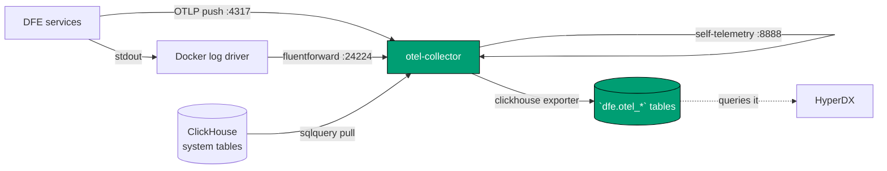

<!--
Project:   dfe-docker
File:      docs/observability.md
Purpose:   How the stack reports on itself, and what each surface proves
Language:  Markdown

License:   BUSL-1.1
Copyright: (c) 2026 HYPERI PTY LIMITED
-->

# How the stack reports on itself

Three surfaces, three different questions.

| Surface | Answers | Where |
|---|---|---|
| Health endpoints | is this process alive, can it work right now | `/livez`, `/readyz` |
| Self-telemetry | what has the stack been doing | the `dfe.otel_*` tables |
| The self test | did an event actually get through | `make post` |

Ingested data is a different question -- [troubleshooting.md](troubleshooting.md).

## The health surface is three paths, with no aliases

Every DFE service serves `/livez`, `/readyz` and `/metrics` on its observability
port and nothing else. `/healthz` and the `/health/*` paths are retired and
**404 on every image pinned here**. `make check-compose` rejects any healthcheck
aimed at one.

| Service | Host port | Notes |
|---|---|---|
| dfe-receiver / loader / archiver / fetcher / transforms | 9090, 9091, 9093-9096 | all three paths |
| dfe-engine | 8003 | `/metrics` is on its container's own 9090, unpublished |
| dfe-ui | none | all three on `:3000`, alongside the app |
| dfe-proxy | 3000 | `/livez`, answered by Envoy itself |
| otel-collector | 13133 | the `health_check` extension |
| hyperdx | 8000 | `/health` -- third party, its own convention |

These bind `DFE_BIND_HOST` (`127.0.0.1`), so curl them from the box, not your
laptop.

On dfe-ui, an unknown path returns the 200 app shell rather than a 404 -- Next.js
routes anything it does not recognise to the page. Only the three paths above are
real there.

## Compose picks liveness or readiness for you

Compose has no readiness condition. `depends_on: service_healthy` is the only
startup gate, so anything others wait on must report READINESS.

| Service | Path | Why |
|---|---|---|
| dfe-loader | `/readyz` | receiver and fetcher wait on it |
| dfe-engine | `/readyz` | loader and proxy wait on it, and it provisions their schema |
| everything else | `/livez` | nothing gates on them |
| otel-collector | none | distroless, so nothing inside can probe `:13133` |

A loader gated on liveness reports healthy while unable to reach ClickHouse, and
the receiver starts against it.

Kubernetes has separate probes and ignores `HEALTHCHECK`, so it never chooses.

## Self-telemetry is pushed, never scraped

The stack's own telemetry leaves by a different door from the data it ingests, so
a broken ingest pipeline cannot take the reporting on it down too.



Services PUSH. HyperDX reads ClickHouse rather than receiving anything -- the
fork ships no OTLP receiver, so the collector's exporter writes the tables it
queries. This is the same chain Kubernetes runs.

Two of the collector's inputs are PULLS, not pushes, because their sources cannot
push. `sqlquery` reads ClickHouse's own `system.metrics`, `system.events` and
`system.parts` on a 30s interval -- the `:9363` Prometheus endpoint is not exposed
by the stack's image, and these system tables are readable on any provider,
managed ClickHouse included. The `prometheus` receiver scrapes the collector's own
`service.telemetry` endpoint on loopback, which is what puts queue depth and
refused/failed counts (`otelcol_*`) into the same pipeline as everything else.

Between them they are what the pre-canned DFE ClickHouse Health and DFE Pipeline
Health dashboards read. Without them those dashboards render empty here while
working on Kubernetes.

`/metrics` is a SEPARATE pathway, for anything that scrapes. This repo ships
nothing that does. Enabling push does not disable it: a Prometheus estate and a
HyperDX estate are both served.

## Turning self-monitoring on

Declare `otel: true` on a profile (`single` does) or set `DFE_OTEL_ENABLED=true`.

| Variable | Default | Effect |
|---|---|---|
| `DFE_OTEL_ENABLED` | `false` | starts the bundled collector |
| `DFE_OTEL_EXPORTER_ENDPOINT` | empty | where services push -- **empty exports nothing** |
| `DFE_OTEL_DATABASE` | `dfe` | database the collector writes |
| `DFE_OTEL_HEALTH_PORT` | `13133` | the `health_check` extension |
| `DFE_ENGINE_METRICS_BACKEND` | `prometheus` | `opentelemetry` makes dfe-engine push |

The endpoint picks the shape. Enabling the profile points services at the bundled
collector. Name your own endpoint and they push there instead, which is how you
feed an external OTLP backend with no bundled collector at all.

The collector's OTLP ports are NOT published. Self-monitoring stays on the
Compose network. Note `4317`/`4318` on the host are dfe-receiver's OTLP INGEST
edge -- data coming in from your estate, pointing the other way.

## What reports

| Component | Pushes? | Why |
|---|---|---|
| the six Rust services | metrics and traces, when built against scalo >= 2.10.11 | scalo's `metrics` feature pulls `otel-metrics` and `otel-tracing`, so OTLP export is on by default (scalo-rs#30) |
| dfe-engine | metrics and traces, once the profile sets the backend | scalo-py has an exporter, its CLI defaults the backend to prometheus (scalo-py#11) |
| dfe-ui | no metrics | `@opentelemetry/api` only, no SDK. Serves `/metrics` on `:3000` |
| every DFE service | LOGS, via Docker's log driver | nothing in the stack exports logs over OTLP, so stdout is shipped instead -- see below |

`OTEL_EXPORTER_OTLP_ENDPOINT` is set on every service regardless, so a rebuilt
component starts reporting with no config change here.

Each Rust service pushes the scalo chassis set -- the `worker_pool_*` family,
`process_*` and `container_*` -- plus whatever it defines itself; the loader adds
`rdkafka_*`. What decides whether a service reports is the scalo version its image
links, not this repo's configuration.

The `opentelemetry` backend is DUAL -- it pushes and keeps serving `/metrics`
(`readers=[otlp(grpc)->..., prometheus(/metrics)]`), so the switch costs a
scraping estate nothing.

## Container logs go through the log driver, not a file reader

Nothing in the stack exports logs over OTLP, so the lines a service writes to
stdout reach ClickHouse a different way: Docker's own `fluentd` log driver sends
them to the collector's `fluentforward` receiver, which turns the driver's tag
into `ServiceName` and writes `dfe.otel_logs`. Search them in HyperDX on the
`otel_logs` source.

Kubernetes reads the same lines off the node with a DaemonSet filelog receiver.
That does not port: the files live under the daemon's data-root, which is not
`/var/lib/docker` on every host and is not on the host at all under Docker
Desktop, and listing that directory needs root. The log driver needs no host path
and no privilege.

**`docker compose logs` cannot read back a fluentd-driven stream.** Only DFE's
own services move onto the driver -- ClickHouse, the broker, the proxies and
HyperDX keep `json-file`, because those are what you read when the DFE side is
the thing that is broken. Put every service back with:

```
DFE_CONTAINER_LOGS_ENABLED=false
```

| Variable | Default | Effect |
|---|---|---|
| `DFE_CONTAINER_LOGS_ENABLED` | `true` | ships DFE container stdout when a collector runs |
| `DFE_CONTAINER_LOG_ADDRESS` | `tcp://127.0.0.1:24224` | where the DAEMON sends it |
| `DFE_OTEL_FLUENT_PORT` | `24224` | the collector's receiver, on `DFE_BIND_HOST` |

The driver runs with `fluentd-async`, so a container starts whether or not the
collector is up. Without it Docker refuses to create a container it cannot reach
a logging endpoint for, which would put the collector on the startup path of the
whole stack. The trade is that lines written while the collector is down are
dropped rather than queued.

Node metrics are still not collected.

## What a passing self test proves

`make post` makes up to five claims, and each one the profile can make must hold:

- **Ingest.** Three marked events posted at the profile's ingest edge come back
  as those exact rows in `dfe.main` inside 60s.
- **Self-monitoring**, when a collector is running. Rows in the `dfe.otel_*` tables
  NEWER than five minutes, and a row in `dfe.otel_logs` under each of
  `dfe-engine`, `dfe-loader` and `dfe-receiver`.
- **Observability**, when HyperDX is running. Its API returns the six seeded
  sources and at least one provisioned dashboard, read through the proxy that
  gives it an identity.
- **Console.** Those same marked rows read back through the engine query API.
- **Hunts.** A hunt created while the runner is up is picked up and writes
  detections.

The freshness window is what makes the second claim mean "streaming now" rather
than "streamed once". The first two are the pair the Kubernetes bootstrap smoke
asserts as CORE 1 and CORE 2.

`complete-single-node-stack` asserts them, plus the HTTP surface through the
proxy. Outcomes and opt-out:
[operating.md](operating.md#the-power-on-self-test-and-what-a-pass-proves).

## Related

- [operating.md](operating.md) -- exposure, limits, secrets, upgrades, the dial
- [troubleshooting.md](troubleshooting.md) -- reading stack state, diagnosing failures
- [architecture.md](architecture.md) -- components, transports, how data moves
