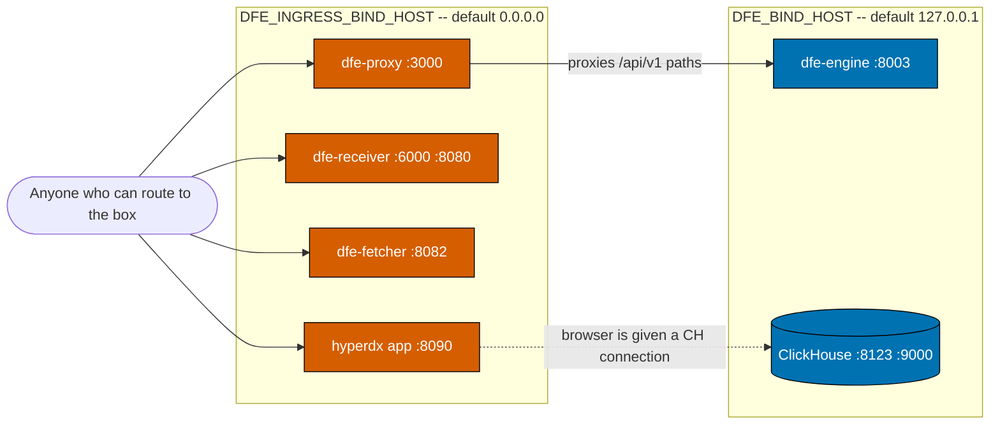

<!--
Project:   dfe-docker
File:      docs/operating.md
Purpose:   Operating the Compose stack where other people depend on it
Language:  Markdown

License:   BUSL-1.1
Copyright: (c) 2026 HYPERI PTY LIMITED
-->

# Operating the DFE Compose stack

This applies to you if people other than you depend on this stack -- a single
box, an edge site, or a partner deployment. Small is still production.

Compose is a supported deploy target for small environments, but the defaults are
tuned for a laptop. Six things change when someone else depends on the box:
access control, port exposure, resource limits, the broker, secrets, and what
your backup actually covers. Kubernetes remains the primary path -- if both would
work, choose Kubernetes.

## There is no authentication -- everything else is bounded by this

Docker mode runs in god-mode by design. Nothing here authenticates anyone. That
is a decision, not an oversight, and it sets a hard limit on what "production"
can mean here.

Envoy is the entrypoint on both tiers now, so the boundary is worth stating
exactly. **dfe-docker can never assume an OIDC issuer exists**, and no profile
may come to require one. When the bundled dex profile lands, OIDC fronts the
proxy origin only -- the UI and the engine's interactive paths -- and only while
that profile runs. Ingest edges, machine API paths, `/.well-known`, `/livez`,
every metrics port, ClickHouse, Kafka, kafka-ui and HyperDX stay outside it. That
mirrors the Kubernetes tier, which applies OIDC per interactive route rather than
at the Gateway, precisely so machine paths are never redirected to a login.



Two consequences survive the loopback defaults below.

**The engine API is reachable from outside regardless of its own binding.**
`dfe-proxy` listens on `:3000` bound to `0.0.0.0` and reverse-proxies `/api/v1/*`
straight through to the dfe-engine API on the Docker network
(`config/proxy/envoy.yaml`). Loopback-binding the engine's own `:8003` does not
protect that API -- the same endpoints answer through the proxy,
unauthenticated, to anyone who can route to the box.

**HyperDX serves the ClickHouse password to browsers.** It runs with
`NEXT_PUBLIC_IS_LOCAL_MODE=true` (no login), and its browser bundle is handed a
ClickHouse connection via `NEXT_PUBLIC_HDX_LOCAL_DEFAULT_CONNECTIONS`. Whatever
you set `CLICKHOUSE_PASSWORD` to is shipped to every browser that loads the
HyperDX app. Setting a password does not make HyperDX safe to expose; it moves
the credential somewhere more people can read it.

So put the stack behind something: a VPN, an SSH tunnel, a firewall, or an
authenticating reverse proxy in front of `:3000` and `:8090`. The bindings below
reduce the accidental surface. They are not access control.

## Port exposure is split by audience

Two variables, chosen by who the port is for.

| Variable | Default | Audience |
|---|---|---|
| `DFE_INGRESS_BIND_HOST` | `0.0.0.0` | What users reach: ingest, the UI proxy, the HyperDX app |
| `DFE_BIND_HOST` | `127.0.0.1` | What operators reach: datastores, broker, metrics, internal gRPC, admin UIs |

Per-port, as published in `docker-compose.yml`:

| Host port | Service | Binds | Purpose |
|---|---|---|---|
| 3000 | dfe-proxy | ingress | UI, plus `/api/v1/*` to the engine |
| 6000 | dfe-receiver | ingress | Vector protocol ingest |
| 8080 | dfe-receiver | ingress | HTTP ingest |
| 8082 | dfe-fetcher | ingress | HTTP ingest |
| 8090 | hyperdx | ingress | HyperDX app UI |
| 8000 | hyperdx | operator | HyperDX API |
| 8003 | dfe-engine | operator | Config and schema API (container `:8000`) |
| 8081 | kafka-ui | operator | Kafbat UI (container `:8080`) |
| 8123 / 9000 | clickhouse | operator | HTTP and native protocol |
| 9092 / 19092 | kafka (either backend) | operator | Plaintext listeners |
| 8686 | dfe-transform-vector | operator | Vector API |
| 9090 | dfe-receiver | operator | Metrics and health |
| 9091 | dfe-loader | operator | Metrics and health |
| 9093 | dfe-archiver | operator | Metrics and health |
| 9094 | dfe-fetcher | operator | Metrics and health |
| 9095 | dfe-transform-vector | operator | Metrics and health |
| 9096 | dfe-transform-vrl | operator | Metrics and health |
| 50051 | dfe-loader | operator | Internal `DfeTransport/Push` gRPC |

`dfe-ui`, `hyperdx-postgres` and `hyperdx-ferretdb` publish no host ports at all
-- they are reached over the Docker network. The receiver's OTLP (`4317`,
`4318`), Beats (`5044`) and HEC (`8088`) mappings are present but commented out;
uncomment them to expose those ingest protocols.

Setting `DFE_BIND_HOST=0.0.0.0` opens every operator port at once, including a
ClickHouse whose `CLICKHOUSE_PASSWORD` defaults to empty and which runs with
`CLICKHOUSE_DEFAULT_ACCESS_MANAGEMENT=1`, and a Kafka UI with dynamic config
enabled. Do it knowingly.

## Resource limits: four tiers, ceilings not reservations

Every service declares `deploy.resources.limits`, which `docker compose up`
honours outside Swarm. An unlimited service on a single box is how one runaway
container takes the host down.

| Tier | Applies to |
|---|---|
| `DFE_CLICKHOUSE_*` | clickhouse |
| `DFE_BROKER_*` | kafka-redpanda, kafka-apache |
| `DFE_SERVICE_*` | the DFE components, engine, UI, kafka-ui, HyperDX, its Postgres and FerretDB |
| `DFE_SIDECAR_*` | kafka-init, dlq-init, dfe-proxy |

For the actual values and totals, ask the stack rather than this page:

```bash
make limits
```

No numbers are written down here on purpose. They were, and they were wrong in
three documents within a day of a service changing tier -- a stale number that
people believe is worse than no number. `make limits` reads the resolved config,
so it cannot drift.

The sizing assumes a 16 GB box **that is also running an operating system and
whatever else that box does**: 16 GB of RAM is not 16 GB of headroom. A box with
every profile enabled wants retuning, not these defaults.

Two properties worth internalising. Limits are ceilings, not reservations --
nothing is pre-allocated, so an idle service costs nothing. And Docker permits an
equal amount of **swap** alongside a memory limit, so a 3G limit can become 3G
RAM plus 3G swap on a swap-enabled host. Set `memswap_limit` equal to the memory
limit per service if you need a genuinely hard cap.

### `DFE_SERVICE_CPUS` has a floor of 2.0, and it is not about speed

Trimming this one to fit a smaller box does not make the DFE services slower --
it makes their health endpoints stop answering while the pipeline carries on
moving data.

Tokio sizes its worker pool from `available_parallelism()`, which reads the
cgroup CPU quota and floors it. Any ceiling under 2.0 therefore leaves a scalo
service with exactly **one** worker thread, and its Kafka poll loop is
synchronous, so that loop owns the thread. The HTTP server carrying `/readyz`,
`/livez` and `/metrics` never gets scheduled: it accepts your connection and
then answers nothing at all.

dfe-archiver did exactly this at a 1.5 ceiling -- healthcheck timing out
forever, container never healthy, events archiving perfectly the whole time.
Raising the ceiling to 2.0 answered in 0.2ms.

`make check-compose` refuses any value under 2.0 on a service that gates on
`/readyz`, so you cannot ship this by accident. If you need the ceiling lower
than the floor, the fix belongs upstream in scalo (its Kafka `recv` wants
`spawn_blocking` or a `StreamConsumer`), not in your `.env`.

## Redpanda ships in developer mode

The default broker command is `--mode=dev-container --smp=1 --memory=1G`. That is
Redpanda's own developer mode (relaxed fsync, single core, 1 GB), chosen so the
stack fits a 4 GB CI runner. It is not a production configuration.

For a small-environment deploy, set `REDPANDA_MODE=production` with real
`REDPANDA_SMP` and `REDPANDA_MEMORY` values -- and raise `DFE_BROKER_MEMORY`
**above** `REDPANDA_MEMORY`. Seastar reserves its `--memory` up front, so a
container limit that does not exceed it means the broker is OOM-killed rather
than backpressured.

## Kafka backend licensing is a human decision

Redpanda's core is source-available under the BSL. It is not OSS. Local
development and CI sit inside its Additional Use Grant. A partner or edge
deployment is a per-deployment licence check, and that check is a question for a
human, not an assumption.

If it does not come back clean, `KAFKA_BACKEND=apache` selects Apache Kafka
(Apache-2.0). The two backends are mutually exclusive, share the `kafka:9092`
network alias and the same host ports, so nothing downstream changes -- configs
address `kafka:9092` either way. Each backend brings its own topic-init service
(`kafka-init-redpanda` uses `rpk`, `kafka-init-apache` uses `kafka-topics.sh`),
so the Apache path pulls and runs no BSL-licensed artefact.

Be precise about what that buys. No Redpanda image is pulled or run, but
`REDPANDA_VERSION` must still be **pinned** for the compose file to resolve,
because Compose interpolates every service before profiles filter anything. A
Redpanda pin in `.env` is not a Redpanda deployment -- but if your licence
position requires zero reference to the artefact, that is the remaining edge.

## Secrets: three are generated

`make init` mints a random value for `DFE_UI_NEXTAUTH_SECRET`,
`HYPERDX_POSTGRES_PASSWORD` and `CLICKHOUSE_PASSWORD`, including topping up an
existing `.env` that predates any of them (`scripts/init.py`). Compose carries a
sentinel (or empty) default rather than a `${VAR:?}` hard-fail -- interpolation is
not profile-gated, so a hard-fail would abort `make down` too, for a service the
operator may not even run. The check lives in the power-on self test instead:
`make post` exits non-zero while any is still at its default.

Be aware of the gap that leaves. The self test auto-runs after `make dev` /
`make ci` but is currently **non-fatal** there, so those commands still succeed
with a default secret in place -- you get a loud message, not a failure. If you
want it enforced, run `make post` as its own step and check the exit code.

`CLICKHOUSE_PASSWORD` guards the ClickHouse default user, which runs with
`CLICKHOUSE_DEFAULT_ACCESS_MANAGEMENT=1` -- full admin. It was blank. `make post`
skips it when `CLICKHOUSE_HOST` points at an external instance, because then the
credential is the operator's, not the stack's. See the upgrade note below -- a
generated password against an existing warehouse volume is a breaking change.

Never commit `.env`.

## Persistence: what survives, and what `make clean` destroys

Eight named volumes hold all durable state:

| Volume | Holds |
|---|---|
| `clickhouse-data` | The ClickHouse warehouse (`/var/lib/clickhouse`) |
| `kafka-redpanda-data` / `kafka-apache-data` | Broker log and offsets, per backend |
| `archiver-data` | dfe-archiver output (`/var/data/archive`) |
| `dlq-spool` | Shared dead-letter spool (`/var/spool/dfe`) |
| `dfe-engine-config` / `dfe-engine-schemas` | Engine config and schemas, seeded from the engine image on first run |
| `hyperdx-pg-data` | HyperDX metadata store |

`make down` stops containers and leaves every volume intact. `make clean` runs
`docker compose --profile "*" down -v --remove-orphans` -- the `-v` deletes all
eight, which now includes the warehouse. It always removed volumes; what changed
is that ClickHouse data is in one.

## The deployment dial: one file the deploy reads

A repeatable deploy turns ONE file. `deployment.example.yaml` is the template;
copy it to `deployment.yaml` (gitignored, never committed) and populate it. That
copy is the SSoT for the deploy -- registry, pinned version, service footprint,
host exposure, the broker, and where the pull credential comes from -- and `make
dial` renders its docker-vm slice into `.env`. A redeploy is a dial edit, not a
hunt through `.env`:

```bash
make dial && make stack && make ci
```

`make dial` writes the deploy-controlled keys over the `.env` that `make init`
generated, `make stack` pins the certified image set from the dial's
`version.pin`, and `make ci` pulls and starts it. Both `stack` and `ci` depend
on `make login`, so registry auth happens on the way through.

Two properties keep the file safe to hand around. **Secrets are references,
never values** -- `secrets.backend` and `secrets.ref` name WHERE the GHCR pull
credential lives (OpenBao by default), and whoever deploys resolves it. On a
lone box you set `DFE_GHCR_USERNAME` and `DFE_GHCR_TOKEN` in `.env` by hand; in
the estate a thin caller reads them from the backend and injects them, so the
dial itself carries no token. **Estate endpoints stay blank** -- an empty
`endpoints.clickhouse_host` means "use the in-stack container", and you set it
(or let the caller inject it) only to point the engine at an external warehouse.

`make login` authenticates docker and oras to `registry` from those two `.env`
keys. `scripts/ghcr_login.py` pipes the token on stdin, so it never reaches a
make variable or the process list, and it is a no-op when the keys are unset --
a daemon that authed out of band is not re-authed -- which is why `stack` and
`ci` depend on it unconditionally.

This file is the docker-vm SLICE. The canonical superset -- docker-vm plus the
Kubernetes and cloud dials, and the schema -- lives in dfe-infra, but a lone
dfe-docker clone deploys from its own `deployment.yaml` alone, with no dfe-infra
checkout needed.

## Staying current: pinned or track-latest

A box stays current one of two mutually exclusive ways. `make modes` states both
and reports which one THIS checkout is on -- ask the stack rather than this page,
for the same reason `make limits` exists.

```bash
make modes                                          # the contract + this box's mode
python3 ops/daemon-update/self_update.py --dry-run  # the live latest-vs-applied
```

**Pinned (default).** `make stack VERSION=X.Y.Z && make ci` pins the whole
certified set from the signed stack-manifest and starts it. It hard-fails rather
than ever pull `latest`. `make dial` sets the pin from the deployment dial's
`version.pin`, so a redeploy is a dial edit plus `make dial && make stack && make
ci`. This is the production-safe default: nothing moves until you move it.

**Track-latest (opt-in).** `ops/daemon-update/install.sh` installs a systemd timer
that discovers the newest certified stack tag and runs the SAME `make stack` +
`make ci`, but only when something newer has shipped. It never pulls `latest`. By
default it tracks STABLE releases only; `DFE_UPDATE_ALLOW_PRERELEASE=1` (commented
in the service unit) also takes `-rc` builds. See
[ops/daemon-update/README.md](../ops/daemon-update/README.md).

The daemon fast-forwards the checkout before pinning, because a stack version is
images plus the compose that runs them. It refuses rather than pull over
uncommitted changes to tracked files, and `DFE_UPDATE_SKIP_GIT_PULL=1` turns the
refresh off for a checkout managed another way. On the pinned path that is your
job: `git pull` before `make stack`, or you get new images under an old compose
file.

The two are mutually exclusive: a track-latest box lets the daemon own the
version, so leave `version.pin` out of the dial there. `make modes` calls it
`AMBIGUOUS` if it finds both set.

> Until a GA stack ships, the only published tag is a pre-release, so a
> stable-only track-latest daemon finds nothing to apply -- pin explicitly, or set
> `DFE_UPDATE_ALLOW_PRERELEASE=1` knowingly.

## Upgrading an existing deployment

Two changes bite an existing stack. Neither is silent if you read this; both are
silent if you do not.

**ClickHouse moved to a named volume.** Its data previously lived in the
container's writable layer and died with `docker compose down`. It now mounts
`clickhouse-data:/var/lib/clickhouse`. On the first `make ci` after upgrading,
the container is recreated against an **empty** volume -- anything still in the
old writable layer is not migrated and will appear to have vanished. Export it
before upgrading if it matters.

**Most published ports moved from `0.0.0.0` to `127.0.0.1`.** Anything
reaching this box from elsewhere -- a remote `clickhouse-client`, a Prometheus
scrape of `:9090-9096`, a colleague's browser -- gets `connection refused` with
no hint as to why. `DFE_BIND_HOST=0.0.0.0` restores the old behaviour, having
read the auth section above.

**`CLICKHOUSE_PASSWORD` is now generated, not blank.** `make init` mints one, so
an upgraded stack that runs `make init` (to pick up new `.env.example` keys) gets
a real password. ClickHouse stores the default-user credential in its data volume
on first init, so a pre-existing `clickhouse-data` volume still expects the OLD
(blank) password and the loader/engine/HyperDX now authenticate with the new one
-- every query fails `Authentication failed`. Two ways through:

- Keep the old behaviour: set `CLICKHOUSE_PASSWORD=` (blank) in `.env` before
  starting. `make init` only tops up a MISSING key, so an explicit blank is kept.
- Adopt the password: set the ClickHouse default user to the generated value once
  (`ALTER USER default IDENTIFIED BY '<value>'` against the running instance, or
  recreate the volume if it holds nothing you need), then restart the stack.

A fresh deployment has neither problem -- the volume is created with the generated
password from the start.

## The power-on self test, and what a PASS proves

`make dev` and `make ci` finish by running `scripts/post.py`. It injects three
uniquely marked events at the ingest edge of the resolved profile and traces them
into ClickHouse.

```bash
make post                        # run against an already-running stack
DFE_POST_ENABLED=false make ci   # opt out
```

It is opt-**out**. A self test you have to remember to run is not a self test.
Tunables: `DFE_POST_HOST` (default `localhost`), `DFE_POST_DATABASE` (`dfe`),
`DFE_POST_TABLE` (`default`).

A PASS proves exactly this: the ingest edge accepted three events, and within 60
seconds at least three rows carrying that run's unique marker were readable in
`dfe.default`. Not "containers started", not "ports answer" -- data moved from
one end to the other. It is transport-agnostic by construction, so it means the
same thing on the Kafka and gRPC profiles.

What it does not prove: anything about tables other than the target, about
profiles you are not running, or about throughput. Three rows is deliberate -- a
self test that writes thousands of rows into a landing table on every boot is one
nobody leaves enabled.

The other outcomes are as informative as the PASS:

- **FAIL on weak secrets** -- `DFE_UI_NEXTAUTH_SECRET` or
  `HYPERDX_POSTGRES_PASSWORD` is still the committed default. Run `make init`.
- **FAIL, not ready** -- the profile declares an ingest component that never
  became ready within 90 seconds. Not the same as a skip, deliberately.
- **FAIL, marker unreadable** -- rows arrived but the marker could not be read
  back, so the schema may not carry `_tags`. It refuses to claim a verification
  it did not make.
- **SKIP** -- the active profile has no ingest component at all (loader-only).
  There is nothing to prove end to end.

## Related

- [README.md](../README.md) -- quick start, profiles, full environment variable reference
- [troubleshooting.md](troubleshooting.md) -- reading stack state, known issues, common failures
- [ARCHITECTURE.md](../ARCHITECTURE.md) -- components, transports, and how data moves
