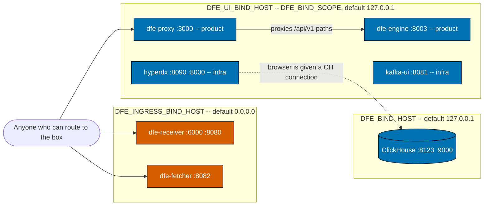

<!--
Project:   dfe-docker
File:      docs/operating.md
Purpose:   Operating the Compose stack where other people depend on it
Language:  Markdown

License:   BUSL-1.1
Copyright: (c) 2026 HYPERI PTY LIMITED
-->

# Operating the DFE Compose stack

This applies to you if people other than you depend on this stack -- a single
box, an edge site, or a partner deployment. Small is still production.

Compose is a supported deploy target for small environments, but the defaults are
tuned for a laptop. Six things change when someone else depends on the box:
access control, port exposure, resource limits, the broker, secrets, and what
your backup actually covers. Kubernetes remains the primary path -- if both would
work, choose Kubernetes.

## Only the console authenticates -- everything else is bounded by that

The engine's API requires a login. `make init` generates
`DFE_AUTH_LOCAL_ADMIN_PASSWORD` into `.env`, and the engine seeds that break-glass
admin on its FIRST start -- a stack whose account store already exists keeps
whatever password it was first given, so rotate through the UI rather than
expecting the generated value to take.

Nothing else in the stack authenticates anyone, and that is the hard limit on what
"production" can mean here: the ingest edges, every metrics port, ClickHouse and
Kafka are open to whoever can route to them. Kafbat and HyperDX are too, unless
the opt-in `auth` profile below is armed -- and even then the gate is at the
proxy, not inside those UIs.

Envoy is the entrypoint on both tiers now, so the boundary is worth stating
exactly. **dfe-docker can never assume an OIDC issuer exists**, and no profile
may come to require one. Where OIDC is wired in, it is scoped per origin and only
while the issuer runs. The opt-in `auth` profile below covers the infra UIs
today; the product origin -- the DFE UI and the engine's interactive paths --
gets the same treatment through dfe-proxy's own filter chain when dfe-engine
becomes the issuer. Ingest edges, machine API paths, `/.well-known`, `/livez`,
every metrics port, ClickHouse and Kafka stay outside it either way. That mirrors
the Kubernetes tier, which applies OIDC per interactive route rather than at the
Gateway, precisely so machine paths are never redirected to a login.



Two consequences survive the loopback defaults below.

**The engine API is reachable from wherever the UI is, regardless of its own
binding.** `dfe-proxy` reverse-proxies `/api/v1/*` straight through to the
dfe-engine API on the Docker network (`config/proxy/envoy.yaml`). Unpublishing
the engine's own `:8003` does not protect that API -- the same endpoints answer
through the proxy, unauthenticated, to anyone who can reach `:3000`.

**HyperDX serves the ClickHouse password to browsers.** It runs with
`NEXT_PUBLIC_IS_LOCAL_MODE=true` (no login), and its browser bundle is handed a
ClickHouse connection via `NEXT_PUBLIC_HDX_LOCAL_DEFAULT_CONNECTIONS`. Whatever
you set `CLICKHOUSE_PASSWORD` to is shipped to every browser that loads the
HyperDX app. Setting a password does not make HyperDX safe to expose; it moves
the credential somewhere more people can read it.

So put the stack behind something: a VPN, an SSH tunnel, a firewall, or an
authenticating reverse proxy in front of `:3000` and `:8090`. The bindings below
reduce the accidental surface. They are not access control.

## Port exposure is split by audience

Three variables, chosen by who the port is for.

| Variable | Default | Audience |
|---|---|---|
| `DFE_INGRESS_BIND_HOST` | `0.0.0.0` | What users push to: receiver and fetcher ingest |
| `DFE_UI_BIND_HOST` | `127.0.0.1` | Every web UI. Derived from `DFE_BIND_SCOPE`, not set by hand |
| `DFE_BIND_HOST` | `127.0.0.1` | What operators reach: datastores, broker, metrics, internal gRPC |

Per-port, as published in `docker-compose.yml`:

| Host port | Service | Binds | Purpose |
|---|---|---|---|
| 3000 | dfe-proxy | ui | UI, plus `/api/v1/*` to the engine |
| 6000 | dfe-receiver | ingress | Vector protocol ingest |
| 8080 | dfe-receiver | ingress | HTTP ingest |
| 8082 | dfe-fetcher | ingress | HTTP ingest |
| 8090 | hyperdx | ui | HyperDX app UI |
| 8000 | hyperdx | ui | HyperDX API |
| 8003 | dfe-engine | ui | Config and schema API (container `:8000`) |
| 8081 | kafka-ui | ui | Kafbat UI (container `:8080`) |
| 8123 / 9000 | clickhouse | operator | HTTP and native protocol |
| 9092 / 19092 | kafka (either backend) | operator | Plaintext listeners |
| 8686 | dfe-transform-vector | operator | Vector API |
| 9090 | dfe-receiver | operator | Metrics and health |
| 9091 | dfe-loader | operator | Metrics and health |
| 9093 | dfe-archiver | operator | Metrics and health |
| 9094 | dfe-fetcher | operator | Metrics and health |
| 9095 | dfe-transform-vector | operator | Metrics and health |
| 9096 | dfe-transform-vrl | operator | Metrics and health |
| 13133 | otel-collector | operator | `health_check` extension |
| 50051 | dfe-loader | operator | Internal `DfeTransport/Push` gRPC |

`dfe-ui`, `hyperdx-postgres` and `hyperdx-ferretdb` publish no host ports at all
-- they are reached over the Docker network. Nor does the collector publish its
OTLP ports: self-monitoring stays on the Compose network. The receiver's OTLP
(`4317`, `4318`), Beats (`5044`) and HEC (`8088`) mappings are present but
commented out; uncomment them to expose those ingest protocols. Note that those
`4317`/`4318` are the receiver's *ingest* edge, not the collector's.

Setting `DFE_BIND_HOST=0.0.0.0` opens every operator port at once, including a
ClickHouse whose `CLICKHOUSE_PASSWORD` defaults to empty and which runs with
`CLICKHOUSE_DEFAULT_ACCESS_MANAGEMENT=1`. Do it knowingly.

## Web UIs: one scope dial, one kill switch

Every web UI publishes by default. `DFE_BIND_SCOPE` says where:

| Mode | Publishes on | For |
|---|---|---|
| `localhost` (default) | `127.0.0.1` | A developer workstation -- the host sees every UI, the LAN does not |
| `all` | `0.0.0.0` | A small or VM deploy |

It moves the UI ports and nothing else. Ingest and the backing services keep the
two surfaces above, so widening the UIs never opens ClickHouse.

Each UI carries a class, and the class decides what can take it dark:

| UI | Service | Class | Flag |
|---|---|---|---|
| DFE UI | dfe-proxy | product | `DFE_UI_EXTERNAL` |
| Engine API | dfe-engine | product | `DFE_ENGINE_API_EXTERNAL` |
| Kafbat | kafka-ui | infra | `DFE_KAFBAT_UI_EXTERNAL` |
| HyperDX | hyperdx | infra | `DFE_HYPERDX_UI_EXTERNAL` |

`DFE_INFRA_UIS_EXTERNAL=false` is the kill switch: it unpublishes every
infra-class UI at once and beats their individual flags. The product UIs are
exempt, so locking the ops surfaces down never takes the DFE UI with it.

Both dials take effect through `make`, which resolves the scope into
`DFE_UI_BIND_HOST` and chains a `docker-compose.unpublish-*.yml` fragment per
opted-out UI. Compose merging can add a ports mapping but never remove one, so
an opt-out has to arrive as a `!reset` fragment rather than an override. A raw
`docker compose` outside `make` therefore publishes everything on loopback.

Unpublishing leaves the container running and reachable on the compose network.
It reduces the accidental surface; it is not access control, and the stack still
authenticates nobody.

`make check-compose` asserts all of it: that every UI follows the scope on both
addresses, that no ingest or backing-service port moves with it, and that each
fragment drops only its own UI.

## Gating the infra UIs with OIDC

`DFE_AUTH_ENABLED=true` arms the `auth` profile, which puts an oauth2-proxy in
front of each infra UI. Reaching Kafbat or HyperDX then needs an OIDC sign-in
**and** membership of one of `DFE_OIDC_ALLOWED_GROUPS` (`dfe-infra`,
`dfe-admin` by default). The group check is the gate -- authentication alone is
not, which is the same rule the Kubernetes tier applies at the Envoy edge.

Three proxies, one per origin, because oauth2-proxy serves a single listener and
HyperDX is one UI across two origins:

| Host port | Proxy | Upstream |
|---|---|---|
| 8081 | oauth2-proxy-kafbat | kafka-ui |
| 8090 | oauth2-proxy-hyperdx | HyperDX app |
| 8000 | oauth2-proxy-hyperdx-api | HyperDX API, which the browser calls directly |

They take those ports over and the UIs stop publishing their own, so nothing
moves for anyone using them. All three share one cookie secret, and cookies are
not port-scoped, so a single sign-in covers the set. Register all three redirect
URIs (`<origin>:<port>/oauth2/callback`) with the IdP, and make sure it emits a
groups claim or every sign-in is refused.

The infra kill switch still wins: `DFE_INFRA_UIS_EXTERNAL=false` unpublishes the
proxies as well as the UIs. A gated door is still a door.

Four limits, none of them cosmetic:

- **It gates page access only.** Neither UI learns who signed in, and neither
  gains a session, roles or an audit trail of its own.
- **It does not contain the HyperDX credential leak.** `NEXT_PUBLIC_*` is inlined
  into the client bundle, so anyone who passes the group check still reads
  `CLICKHOUSE_PASSWORD` out of the JavaScript.
- **An expired session on the API origin fails opaquely.** A cross-origin XHR
  that gets a redirect to the IdP is blocked by the browser, so the app shows
  failed requests rather than a login prompt. Reload the app page to sign back
  in.
- **Nothing else moves behind it.** Ingest, ClickHouse, Kafka, the metrics ports
  and the product UIs are untouched.

Off by default, and it must stay possible to run every other profile without an
issuer. Arming it with a setting missing stops `make` and names the key rather
than starting a proxy that redirects nowhere.

## Resource limits: four tiers, ceilings not reservations

Every service declares `deploy.resources.limits`, which `docker compose up`
honours outside Swarm. An unlimited service on a single box is how one runaway
container takes the host down.

| Tier | Applies to |
|---|---|
| `DFE_CLICKHOUSE_*` | clickhouse |
| `DFE_BROKER_*` | kafka-redpanda, kafka-apache |
| `DFE_SERVICE_*` | the DFE components, engine, UI, kafka-ui, HyperDX, its Postgres and FerretDB |
| `DFE_SIDECAR_*` | kafka-init, dlq-init, dfe-proxy |

For the actual values and totals, ask the stack rather than this page:

```bash
make limits
```

No numbers are written down here on purpose. They were, and they were wrong in
three documents within a day of a service changing tier -- a stale number that
people believe is worse than no number. `make limits` reads the resolved config,
so it cannot drift.

The sizing assumes a 16 GB box **that is also running an operating system and
whatever else that box does**: 16 GB of RAM is not 16 GB of headroom. A box with
every profile enabled wants retuning, not these defaults.

Two properties worth internalising. Limits are ceilings, not reservations --
nothing is pre-allocated, so an idle service costs nothing. And Docker permits an
equal amount of **swap** alongside a memory limit, so a 3G limit can become 3G
RAM plus 3G swap on a swap-enabled host. Set `memswap_limit` equal to the memory
limit per service if you need a genuinely hard cap.

Reservations are omitted deliberately: only memory maps outside Swarm, and a soft
floor that half-applies reads as configuration doing more than it does. The
sidecar tier is 512M rather than less because `kafka-init-apache` runs a JVM
(`kafka-topics.sh`), and a smaller cap risks an OOM kill on a service whose whole
job is to exit cleanly.

### `DFE_SERVICE_CPUS` has a floor of 2.0, and it is not about speed

Trimming this one to fit a smaller box does not make the DFE services slower --
it makes their health endpoints stop answering while the pipeline carries on
moving data.

Tokio sizes its worker pool from `available_parallelism()`, which reads the
cgroup CPU quota and floors it. Any ceiling under 2.0 therefore leaves a scalo
service with exactly **one** worker thread, and its Kafka poll loop is
synchronous, so that loop owns the thread. The HTTP server carrying `/readyz`,
`/livez` and `/metrics` never gets scheduled: it accepts your connection and
then answers nothing at all.

The symptom on dfe-archiver at a 1.5 ceiling is a healthcheck that times out
forever while events archive normally. `TOKIO_WORKER_THREADS=4` at that same
ceiling restores the endpoints, which is how you tell worker-thread starvation
from a shortage of CPU.

`make check-compose` refuses any value under 2.0 on a service that gates on
`/readyz`, so you cannot ship this by accident. If you need the ceiling lower
than the floor, the fix belongs upstream in scalo (its Kafka `recv` wants
`spawn_blocking` or a `StreamConsumer`), not in your `.env`.

## Redpanda ships in developer mode

The default broker command is `--mode=dev-container --smp=1 --memory=1G`. That is
Redpanda's own developer mode (relaxed fsync, single core, 1 GB), chosen so the
stack fits a 4 GB CI runner. It is not a production configuration.

For a small-environment deploy, set `REDPANDA_MODE=production` with real
`REDPANDA_SMP` and `REDPANDA_MEMORY` values -- and raise `DFE_BROKER_MEMORY`
**above** `REDPANDA_MEMORY`. Seastar reserves its `--memory` up front, so a
container limit that does not exceed it means the broker is OOM-killed rather
than backpressured.

## Kafka backend licensing is a human decision

Redpanda's core is source-available under the BSL. It is not OSS. Local
development and CI sit inside its Additional Use Grant. A partner or edge
deployment is a per-deployment licence check, and that check is a question for a
human, not an assumption.

If it does not come back clean, `KAFKA_BACKEND=apache` selects Apache Kafka
(Apache-2.0). The two backends are mutually exclusive, share the `kafka:9092`
network alias and the same host ports, so nothing downstream changes -- configs
address `kafka:9092` either way. Each backend brings its own topic-init service
(`kafka-init-redpanda` uses `rpk`, `kafka-init-apache` uses `kafka-topics.sh`),
so the Apache path pulls and runs no BSL-licensed artefact.

Be precise about what that buys. No Redpanda image is pulled or run, but
`REDPANDA_VERSION` must still be **pinned** for the compose file to resolve,
because Compose interpolates every service before profiles filter anything. A
Redpanda pin in `.env` is not a Redpanda deployment -- but if your licence
position requires zero reference to the artefact, that is the remaining edge.

## Secrets: three are generated

`make init` mints a random value for `DFE_UI_NEXTAUTH_SECRET`,
`HYPERDX_POSTGRES_PASSWORD` and `CLICKHOUSE_PASSWORD`, including topping up an
existing `.env` that predates any of them (`scripts/init.py`). Compose carries a
sentinel (or empty) default rather than a `${VAR:?}` hard-fail -- interpolation is
not profile-gated, so a hard-fail would abort `make down` too, for a service the
operator may not even run. The check lives in the power-on self test instead:
`make post` exits non-zero while any is still at its default.

Be aware of the gap that leaves. The self test auto-runs after `make dev` /
`make ci` but is currently **non-fatal** there, so those commands still succeed
with a default secret in place -- you get a loud message, not a failure. If you
want it enforced, run `make post` as its own step and check the exit code.

`CLICKHOUSE_PASSWORD` guards the ClickHouse default user, which runs with
`CLICKHOUSE_DEFAULT_ACCESS_MANAGEMENT=1` -- full admin. It was blank. `make post`
skips it when `CLICKHOUSE_HOST` points at an external instance, because then the
credential is the operator's, not the stack's. See the upgrade note below -- a
generated password against an existing warehouse volume is a breaking change.

Never commit `.env`.

## Persistence: what survives, and what `make clean` destroys

Eight named volumes hold all durable state:

| Volume | Holds |
|---|---|
| `clickhouse-data` | The ClickHouse warehouse (`/var/lib/clickhouse`) |
| `kafka-redpanda-data` / `kafka-apache-data` | Broker log and offsets, per backend |
| `archiver-data` | dfe-archiver output (`/var/data/archive`) |
| `dlq-spool` | Shared dead-letter spool (`/var/spool/dfe`) |
| `dfe-engine-config` / `dfe-engine-schemas` | Engine config and schemas, seeded from the engine image on first run |
| `hyperdx-pg-data` | HyperDX metadata store |

`make down` stops containers and leaves every volume intact. `make clean` runs
`docker compose --profile "*" down -v --remove-orphans` -- the `-v` deletes all
eight, which now includes the warehouse. It always removed volumes; what changed
is that ClickHouse data is in one.

### External data location

ClickHouse and Kafka grow, and `/var/lib/docker` is rarely the disk sized for
them. Set `DFE_DATA_ROOT` (in `.env` or the environment) and every volume above
becomes a bind onto `${DFE_DATA_ROOT}/<name>` via `docker-compose.storage.yml`
-- the make targets create the directories and chain the overlay on every path,
`make ci` included. The k8s charts parameterise the same choice through
`storageClass` and size.

Two consequences to know: switching an existing deployment does not migrate
data between locations, and `make clean` removes the volume objects while the
bind directories keep their contents -- reclaiming the space is an explicit
delete of `${DFE_DATA_ROOT}`.

## Deploying and upgrading

A deploy turns one file -- `deployment.yaml` -- and pins one stack version.
`make dial && make stack && make ci` is the whole loop. Tracking a channel
instead of a pin, and what an upgrade does to a running stack, are in
[deploying.md](deploying.md).

## The power-on self test, and what a PASS proves

`make dev` and `make ci` finish by running `scripts/post.py`. It injects three
uniquely marked events at the ingest edge of the resolved profile and traces them
into ClickHouse.

```bash
make post                        # run against an already-running stack
DFE_POST_ENABLED=false make ci   # opt out
```

It is opt-**out**. A self test you have to remember to run is not a self test.
Tunables: `DFE_POST_HOST` (default `localhost`), `DFE_POST_DATABASE` (`dfe`),
`DFE_POST_TABLE` (`default`).

A PASS proves exactly this: the ingest edge accepted three events, and within 60
seconds at least three rows carrying that run's unique marker were readable in
`dfe.default`. Not "containers started", not "ports answer" -- data moved from
one end to the other. It is transport-agnostic by construction, so it means the
same thing on the Kafka and gRPC profiles.

On a profile that runs the collector it makes a **second** claim, and both must
hold: that the stack's own telemetry is landing fresh in the `dfe.otel_*` tables.
That is the pair the Kubernetes bootstrap smoke asserts as CORE 1 and CORE 2 --
the two pipelines a complete deployment has to move.

What it does not prove: anything about tables other than the target, about
profiles you are not running, or about throughput. Three rows is deliberate -- a
self test that writes thousands of rows into a landing table on every boot is one
nobody leaves enabled.

The other outcomes are as informative as the PASS:

- **FAIL on weak secrets** -- `DFE_UI_NEXTAUTH_SECRET` or
  `HYPERDX_POSTGRES_PASSWORD` is still the committed default. Run `make init`.
- **FAIL, not ready** -- the profile declares an ingest component that never
  became ready within 90 seconds. Not the same as a skip, deliberately.
- **FAIL, marker unreadable** -- rows arrived but the marker could not be read
  back, so the schema may not carry `_tags`. It refuses to claim a verification
  it did not make.
- **SKIP** -- the active profile has no ingest component at all (loader-only).
  There is nothing to prove end to end.
- **FAIL, no otel schema** -- the collector is in the profile but never wrote its
  tables. It cannot reach ClickHouse; read its logs.
- **FAIL, no fresh rows** -- the tables exist and nothing recent is in them, so
  the services are not exporting. See below.

## Self-monitoring

The stack's own telemetry goes out over OTLP to a collector, which writes the
`dfe.otel_*` tables that HyperDX reads. Turn it on with `otel: true` on a
profile (`single` has it) or `DFE_OTEL_ENABLED=true`.

The apps push over OTLP -- on `single` that is dfe-engine, dfe-receiver and
dfe-loader. Two things do scrape: the collector scrapes its own metrics on
127.0.0.1:8888, and `sqlquery` reads ClickHouse. Nothing on this path sends
logs -- there is no container-log collector, and the apps export metrics and
traces only -- so `dfe.otel_logs` stays empty even though the collector has a
logs pipeline wired. See [observability.md](observability.md), which also has
the dials, what each component does, and why `/metrics` still exists.

## Related

- [deploying.md](deploying.md) -- the dial, pinning, upgrading a running stack
- [observability.md](observability.md) -- health surface, self-telemetry, the self test
- [configuration.md](configuration.md) -- every variable, port and image
- [troubleshooting.md](troubleshooting.md) -- reading stack state, known issues, common failures
- [architecture.md](architecture.md) -- components, transports, and how data moves
