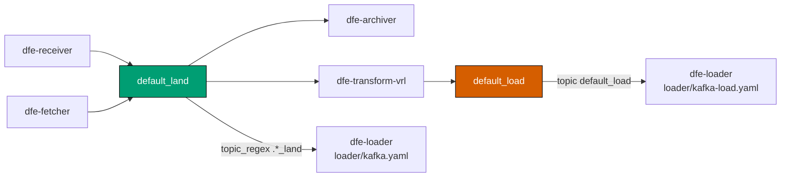

<!--
Project:   dfe-docker
File:      docs/troubleshooting.md
Purpose:   Reading stack state, known issues, and common failure diagnosis
Language:  Markdown

License:   BUSL-1.1
Copyright: (c) 2026 HYPERI PTY LIMITED
-->

# Troubleshooting the DFE Compose stack

This applies to you if a stack is misbehaving and you need to find out why --
yours or someone else's.

Start with the state of the stack, then the known issues below, then the failure
you are actually chasing. Several of the known issues produce symptoms that look
like something else entirely, so read them before you go deep.

## Reading the stack's state

`docker compose ps` (or `make ps`) is the first call. It shows which containers
exist and their health, but only for the currently resolved profile -- see the
first known issue below, because a stray container from a previous profile will
not show up there while still holding its ports.

Health endpoints, straight from the host:

Three paths, the same three on every DFE service: `/livez` (process alive),
`/readyz` (can it serve -- dependency checks live here) and `/metrics`. There are
no aliases. `/healthz`, `/health/live`, `/health/ready` and `/health/startup` are
retired and return **404** on every image the stack pins, so a probe still aimed
at one reads as a service that never comes up.

| Service | Host port | Paths |
|---|---|---|
| dfe-receiver | 9090 | `/livez`, `/readyz`, `/metrics` |
| dfe-loader | 9091 | same |
| dfe-archiver | 9093 | same |
| dfe-fetcher | 9094 | same |
| dfe-transform-vector | 9095 | same |
| dfe-transform-vrl | 9096 | same |
| dfe-engine | 8003 | `/livez`, `/readyz` (its `/metrics` is on the container's own 9090, not published) |
| dfe-proxy | 3000 | `/livez`, served by envoy itself with no backend |
| hyperdx | 8000 | `/health` -- a third-party app on its own convention |

`dfe-ui` is the exception worth knowing: it answers **200 on every path**,
including ones that do not exist, so its healthcheck proves the Node server is
listening and nothing more.

Every one of those ports binds `DFE_BIND_HOST` (`127.0.0.1` by default), so curl
them from the box itself, not from your laptop.

```bash
curl -sf http://localhost:9091/readyz     # loader ready?
curl -sf http://localhost:8003/readyz     # engine ready?
```

### Why the compose healthchecks use readiness, not liveness

Normally a Docker `HEALTHCHECK` is a liveness check. Here it is deliberately
readiness, because in Compose the healthcheck is *also* what
`depends_on: condition: service_healthy` gates on -- it is the only startup gate
there is.

Gate on `/livez` and a loader that cannot reach ClickHouse still reports
healthy. The receiver then starts against it, `docker compose ps` shows green,
and events pile up with nothing surfacing the fault. `/readyz` is where the
dependency checks live, so it is the one that can gate a start. Kubernetes itself has separate liveness and
readiness probes and ignores `HEALTHCHECK` entirely, so it never has this
tension.

## Known issues

These are real and currently open. Each one has a symptom that misleads.

### Stray containers from a previous profile (fixed, but worth recognising)

`make down` now runs `docker compose -f docker-compose.yml --profile "*" down
--remove-orphans`, so it tears down every profile and keeps volumes. Switching
profiles no longer strands anything.

It used to be profile-scoped, and if you are on an older checkout it still is:
switch from a receiver-based profile to a fetcher-based one and the old receiver
keeps running, keeps answering on `:8080`, and keeps its ports. The misleading
part is that the stray is wired to a pipeline that is no longer running, so
anything probing ports rather than asking the profile finds it and reports a
data-path failure that is really a stale container. That is why
`scripts/post.py` resolves its ingest edge from `.profile.mk` instead of probing.

If you suspect strays, `docker ps` and compare uptimes -- a container minutes
older than the rest is the giveaway.

### `.env` shadows command-line environment variables through make

The Makefile does `-include .env`. GNU make gives makefile assignments precedence
over environment variables, and re-exports them to recipes. So for any key with a
live (uncommented) assignment in `.env`, `VAR=x make ...` silently no-ops -- the
child process sees the `.env` value.

This was reproduced with a throwaway Makefile carrying the same `-include .env`,
not against a target in this repo -- there is no `make show` here.

This bites hardest after `make stack`, which writes live `*_VERSION` pins into
`.env`, and after `make init`, which writes the generated secrets. Three ways
around it:

```bash
make dev KAFKA_BACKEND=apache     # make command-line variable -- wins, exported
KAFKA_BACKEND=apache make -e dev  # -e flips the precedence
```

...or edit `.env`, which is the durable answer.

### `config/loader/kafka-load.yaml` consumes a topic nothing pre-creates



`kafka-init-redpanda` and `kafka-init-apache` each pre-create `default_land` and
nothing else. `config/loader/kafka-load.yaml` subscribes to `default_load`, which
is produced by `config/transform-vrl/kafka.yaml`. That topic exists only if broker
auto-creation makes it. The profiles affected are the ones that point the loader
at `kafka-load.yaml`: `kafka-receiver-transform-vector` and
`kafka-full-transform-vrl`.

The topic names are literals in those YAML files, not env-interpolated. If you
change one, change it in the init services and the configs together.

Do not close this gap by pre-creating `default_load` in the init services. The
loader auto-discovers topics and scalo suppresses `<base>_land` whenever
`<base>_load` exists, on the reasoning that a `_load` topic means a transform has
already produced the loadable form and the raw landing topic is redundant. Creating
`default_load` on every Kafka profile therefore drops `default_land` from the
subscription of every loader that is not running a transform -- which is most of
them. It was tried, and it took both Kafka e2e tests from 1000 rows to 0 while the
gRPC tests stayed green: ingest still returned 200, the receiver still produced to
`default_land`, the topic still showed a rising high watermark, and nothing
consumed it.

Reverting the change does not restore a broker that already has the topic.
`kafka-redpanda-data` and `kafka-apache-data` outlive the containers, so the topic
persists and keeps suppressing `default_land` on every later run. Delete it:

```bash
docker compose exec kafka-redpanda rpk topic delete default_load -X brokers=kafka:9092
```

The e2e harness now does this for itself: `clean_topics` deletes the `_load`
sibling of every expected `_land` topic, so a run depends on the test definition
rather than on the broker's history.

### `hyperi-hyperdx` is the one image still on a floating tag

Every other image in the stack is pinned to `tag@digest` by `make stack` from the
DFE stack SSoT, and compose hard-fails (`${VAR:?}`) rather than resolving a
missing pin to `latest`. `hyperi-hyperdx` uses `${DFE_HYPERDX_VERSION:-latest}`
because the fork is unpublished, so the SSoT cannot emit a pin for it. Until that
fork ships, the opt-in `hyperdx` profile does not carry the pinning guarantee the
rest of the stack does.

## Events are accepted but nothing lands

The ingest edge returning 2xx only means the event was accepted. Work down this
order.


**Loader health first.** `curl -sf http://localhost:9091/readyz`. A loader that
cannot reach ClickHouse is the single most common cause, and readiness is what
tells you.

**Then the schema.** dfe-engine is the schema authority: it ships `/app/schemas`
inside its own image, creates the ClickHouse objects at startup, and the loader
pre-warms those schemas into its cache. Nothing in this repo provisions tables.
If the engine has not provisioned, the loader holds every message pending-schema
and dead-letters after a timeout. Check `dfe.default` exists and that the engine
is healthy.

**Then the topic.** On a Kafka profile, do not check that the topic exists -- check
what the loader actually SUBSCRIBED to. Those are different questions, and the gap
between them is where this hides: with `topic_regex`, the loader logs its resolved
set once at startup, and a topic can exist, be produced to, and still not be in it.

```bash
docker compose logs dfe-loader | grep "Resolved Kafka topics"
docker compose exec kafka-redpanda rpk group describe dfe-loader -X brokers=kafka:9092
```

If the topic the receiver produces to is missing from the resolved list, read the
`default_load` issue above -- a `_load` sibling suppresses the `_land` topic.
Kafbat on `:8081` shows the produced-to topic and its high watermark, which is the
other half of the picture.

**Then the DLQ**, below.

## The DLQ spool

`dlq-spool` is a shared volume mounted at `/var/spool/dfe` by dfe-archiver,
dfe-fetcher, dfe-loader and dfe-receiver. All four run as non-root `appuser` (uid
1000), and none of the images pre-creates that path, so Docker creates the
mountpoint owned by root and no service can write inside it. The `dlq-init`
one-shot (`chown -R 1000:1000 /var/spool/dfe`) fixes that before the services
start.

That failure mode is not theoretical. dfe-archiver creates its DLQ writer eagerly
at startup and crash-looped with `DLQ init failed ... Permission denied (os error
13)`. The others create theirs lazily on first dead-letter, so they look healthy
right up until something actually needs to dead-letter -- the worst moment to
discover the DLQ never worked.

**Files under `/var/spool/dfe/dlq` mean events were accepted and then could not be
delivered.** They are evidence, not noise: read them to see what was rejected and
why. Note that the shipped loader configs set `routing.dlq.enabled: false`, so on
those profiles spooled files come from another component, not the loader.

```bash
docker compose exec dfe-loader ls -la /var/spool/dfe/dlq
```

## Common failures

### A service is unhealthy but the data is landing

Symptom: `docker compose ps` shows a DFE service unhealthy or perpetually
starting, `docker inspect` reports `Health check exceeded timeout`, and yet
events are flowing through that very service. Curl its port from inside the
container and the connection is *accepted* instantly and then never answered --
not refused, not reset, just silent. `/livez` and `/metrics` behave the same
way, which rules out the readiness logic.

That is Tokio worker-thread starvation, and the cause is the CPU ceiling.
`available_parallelism()` reads the cgroup quota and floors it, so a ceiling
under 2.0 gives the service one worker thread; scalo's Kafka `recv` polls
synchronously and owns it; the HTTP server task never runs.

```bash
docker inspect --format '{{.HostConfig.NanoCpus}}' dfe-archiver   # 1500000000 = 1.5
```

Put `DFE_SERVICE_CPUS` back to 2.0 or above and recreate the service. To confirm
the diagnosis without touching the ceiling, set `TOKIO_WORKER_THREADS=4` in
`env/<service>.env` and recreate -- if it answers, it was starvation and not a
shortage of CPU.

`make check-compose` blocks a sub-2.0 ceiling on any service that gates on
`/readyz`, so this should only reach you via a hand-edited override.

### `port is already allocated`

Usually an always-on dev daemon holding `9092`. The stack and the e2e harness
reach the broker over the Docker network alias `kafka:9092`, so any free host
port works:

```bash
make test-e2e KAFKA_PLAINTEXT_PORT=29092 KAFKA_PLAINTEXT_HOST_PORT=29192
```

Note the argument position -- if those keys are live in your `.env`, the
`VAR=x make ...` form will not take. See the shadowing issue above.

The gRPC-only tests need no broker at all:

```bash
make test-e2e E2E_TESTS="simple-receiver-to-loader-grpc simple-fetcher-to-loader"
```

Also check for a stray container from a previous profile before assuming the
port belongs to something else.

### Compose refuses to start: `is missing a value`

The stack is unpinned. Image versions come from the DFE stack SSoT, not from
defaults -- there is no silent `latest` fallback:

```bash
make stack VERSION=X.Y.Z
```

`make check-hardfail` asserts this property holds, by running compose with
nothing set and requiring that it fails for the right reason. A green run proves
the stack refuses to resolve with nothing set; it does not prove every single
image is pinned, because compose aborts on the first missing variable.

### `PyYAML is required and not installed`

PyYAML is the e2e harness's only third-party dependency, and it is not in the
standard library:

```bash
pip install pyyaml
uv run --with pyyaml python3 scripts/test_e2e.py   # or run it this way
```

The power-on self test (`scripts/post.py`) has no such dependency -- it is
stdlib-only and works on a bare machine.

## Related

- [operating.md](operating.md) -- auth position, exposure, limits, secrets, upgrades
- [README.md](../README.md) -- profiles, make targets, full environment variable reference
