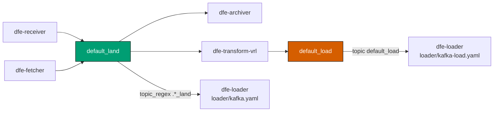
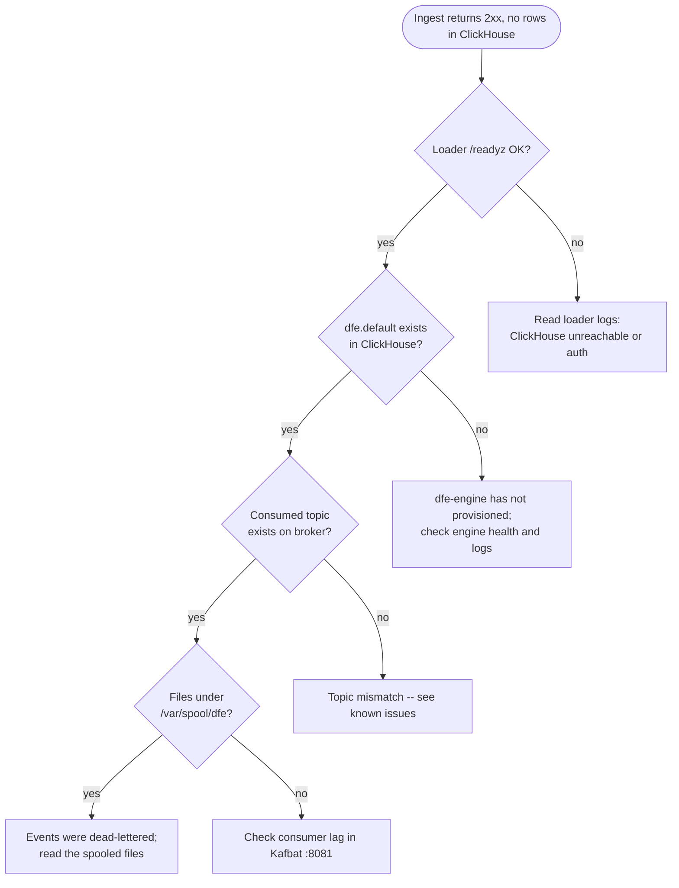

<!--
Project:   dfe-docker
File:      docs/troubleshooting.md
Purpose:   Reading stack state, known issues, and common failure diagnosis
Language:  Markdown

License:   BUSL-1.1
Copyright: (c) 2026 HYPERI PTY LIMITED
-->

# Troubleshooting the DFE Compose stack

This applies to you if a stack is misbehaving and you need to find out why --
yours or someone else's.

Start with the state of the stack, then the known issues below, then the failure
you are actually chasing. Several of the known issues produce symptoms that look
like something else entirely, so read them before you go deep.

## Reading the stack's state

`docker compose ps` (or `make ps`) is the first call. It shows which containers
exist and their health, but only for the profile resolved from `.env` -- see the
first known issue below, because a stray container from a previous profile will
not show up there while still holding its ports.

Health endpoints, straight from the host. Every DFE service serves `/livez`,
`/readyz` and `/metrics` and nothing else -- the retired `/health*` paths 404, so
a probe left on one reads as a service that never came up.

```bash
curl -sf http://localhost:9091/readyz     # loader ready?
curl -sf http://localhost:8003/readyz     # engine ready?
curl -sf http://localhost:13133/          # collector healthy? (otel profile only)
```

Ports bind `DFE_BIND_HOST` (`127.0.0.1`), so curl them from the box. The full
port table, which path each HEALTHCHECK uses and why, and dfe-ui's 200-on-unknown
-paths trap are in [observability.md](observability.md).

## Known issues

These are real and open. Each one has a symptom that misleads.

### Stray containers from a previous profile (fixed, but worth recognising)

`make down` now runs `docker compose -f docker-compose.yml --profile "*" down
--remove-orphans`, so it tears down every profile and keeps volumes. Switching
profiles no longer strands anything.

It used to be profile-scoped, and if you are on an older checkout it still is:
switch from a receiver-based profile to a fetcher-based one and the old receiver
keeps running, keeps answering on `:8080`, and keeps its ports. The misleading
part is that the stray is wired to a pipeline that is no longer running, so
anything probing ports rather than asking the profile finds it and reports a
data-path failure that is really a stale container. That is why
`scripts/post.py` resolves its ingest edge from `.profile.mk` instead of probing.

If you suspect strays, `docker ps` and compare uptimes -- a container minutes
older than the rest is the giveaway.

### `.env` shadows command-line environment variables through make

The Makefile does `-include .env`. GNU make gives makefile assignments precedence
over environment variables, and re-exports them to recipes. So for any key with a
live (uncommented) assignment in `.env`, `VAR=x make ...` silently no-ops -- the
child process sees the `.env` value.

This was reproduced with a throwaway Makefile carrying the same `-include .env`,
not against a target in this repo -- there is no `make show` here.

This bites hardest after `make stack`, which writes live `*_VERSION` pins into
`.env`, and after `make init`, which writes the generated secrets. Three ways
around it:

```bash
make dev KAFKA_BACKEND=apache     # make command-line variable -- wins, exported
KAFKA_BACKEND=apache make -e dev  # -e flips the precedence
```

...or edit `.env`, which is the durable answer.

### `config/loader/kafka-load.yaml` consumes a topic nothing pre-creates



`kafka-init-redpanda` and `kafka-init-apache` each pre-create `default_land` and
nothing else. `config/loader/kafka-load.yaml` subscribes to `default_load`, which
is produced by `config/transform-vrl/kafka.yaml`. That topic exists only if broker
auto-creation makes it. The profiles affected are the ones that point the loader
at `kafka-load.yaml`: `kafka-receiver-transform-vector` and
`kafka-full-transform-vrl`.

The topic names are literals in those YAML files, not env-interpolated. If you
change one, change it in the init services and the configs together. A single
topic variable cannot work: the consumers name their topics in their own YAML, so
setting it pre-creates a topic nobody consumes and stops pre-creating the one
they do.

There is one topic-init service per backend, each running its own broker's
tooling, so choosing Apache Kafka to stay clear of the BSL never pulls a BSL
artefact. Downstream services depend on both with `required: false`; exactly one
exists for any profile, so the other is a no-op.

**Do not close this gap by pre-creating `default_load` in the init services.**
The loader auto-discovers topics and scalo suppresses `<base>_land` whenever
`<base>_load` exists, on the reasoning that a `_load` topic means a transform has
already produced the loadable form. Creating `default_load` on every Kafka profile
therefore drops `default_land` from the subscription of every loader not running a
transform, which is most of them. The symptom is maximally misleading: ingest
returns 200, the receiver produces to `default_land`, the topic shows a rising
high watermark, and no rows reach ClickHouse.

Reverting the change does not restore a broker that already has the topic.
`kafka-redpanda-data` and `kafka-apache-data` outlive the containers, so the topic
persists and keeps suppressing `default_land` on every later run. Delete it:

```bash
docker compose exec kafka-redpanda rpk topic delete default_load -X brokers=kafka:9092
```

The e2e harness now does this for itself: `clean_topics` deletes the `_load`
sibling of every expected `_land` topic, so a run depends on the test definition
rather than on the broker's history.

## Events are accepted but nothing lands

The ingest edge returning 2xx only means the event was accepted. Work down this
order.



**Loader health first.** `curl -sf http://localhost:9091/readyz`. A loader that
cannot reach ClickHouse is the single most common cause, and readiness is what
tells you.

**Then the schema.** dfe-engine is the schema authority: it ships `/app/schemas`
inside its own image, creates the ClickHouse objects at startup, and the loader
pre-warms those schemas into its cache. Nothing in this repo provisions tables.
If the engine has not provisioned, the loader holds every message pending-schema
and dead-letters after a timeout. Check `dfe.default` exists and that the engine
is healthy.

**Then the topic.** On a Kafka profile, do not check that the topic exists -- check
what the loader actually SUBSCRIBED to. Those are different questions, and the gap
between them is where this hides: with `topic_regex`, the loader logs its resolved
set once at startup, and a topic can exist, be produced to, and still not be in it.

```bash
docker compose logs dfe-loader | grep "Resolved Kafka topics"
docker compose exec kafka-redpanda rpk group describe dfe-loader -X brokers=kafka:9092
```

If the topic the receiver produces to is missing from the resolved list, read the
`default_load` issue above -- a `_load` sibling suppresses the `_land` topic.
Kafbat on `:8081` shows the produced-to topic and its high watermark, which is the
other half of the picture.

**Then the DLQ**, below.

## The DLQ spool

`dlq-spool` is a shared volume mounted at `/var/spool/dfe` by dfe-archiver,
dfe-fetcher, dfe-loader and dfe-receiver. All four run as non-root `appuser` (uid
1000), and none of the images pre-creates that path, so Docker creates the
mountpoint owned by root and no service can write inside it. The `dlq-init`
one-shot (`chown -R 1000:1000 /var/spool/dfe`) fixes that before the services
start.

Without it, dfe-archiver crash-loops on `DLQ init failed ... Permission denied
(os error 13)` -- it creates its DLQ writer eagerly at startup. The others create
theirs lazily on first dead-letter, so they look healthy until something needs to
dead-letter, which is the worst moment to find the DLQ never worked.

Per-service volumes do not fix it: a fresh volume is root-owned too, because
ownership is inherited from a path the image does not have. The real fix is for
the component images to create `/var/spool/dfe` as appuser. The one-shot reuses
the archiver image because that image is already pinned.

Three ways that arrangement fails:

1. `required: false` on the dependents means a **failed** dlq-init does not stop
   them -- Compose logs one warning and carries on with a zero exit. Watch for
   the warning.
2. uid 1000 is hard-coded and nothing verifies it, so an image that renumbers
   appuser breaks the DLQ silently.
3. In dev mode dlq-init resolves to the **registry** archiver image, because
   `docker-compose.override.yml` does not map it. `make dev` therefore needs GHCR
   access and a pinned `DFE_ARCHIVER_VERSION` even on profiles with no archiver.

**Files under `/var/spool/dfe/dlq` mean events were accepted and then could not be
delivered.** They are evidence, not noise: read them to see what was rejected and
why. Note that the shipped loader configs set `routing.dlq.enabled: false`, so on
those profiles spooled files come from another component, not the loader.

```bash
docker compose exec dfe-loader ls -la /var/spool/dfe/dlq
```

## Common failures

### A service is unhealthy but the data is landing

Symptom: `docker compose ps` shows a DFE service unhealthy or perpetually
starting, `docker inspect` reports `Health check exceeded timeout`, and yet
events are flowing through that very service. Curl its port from inside the
container and the connection is *accepted* instantly and then never answered --
not refused, not reset, just silent. `/livez` and `/metrics` behave the same
way, which rules out the readiness logic.

That is Tokio worker-thread starvation, and the cause is the CPU ceiling.
`available_parallelism()` reads the cgroup quota and floors it, so a ceiling
under 2.0 gives the service one worker thread; scalo's Kafka `recv` polls
synchronously and owns it; the HTTP server task never runs.

```bash
docker inspect --format '{{.HostConfig.NanoCpus}}' dfe-archiver   # 1500000000 = 1.5
```

Put `DFE_SERVICE_CPUS` back to 2.0 or above and recreate the service. To confirm
the diagnosis without touching the ceiling, set `TOKIO_WORKER_THREADS=4` in
`env/<service>.env` and recreate -- if it answers, it was starvation and not a
shortage of CPU.

`make check-compose` blocks a sub-2.0 ceiling on any service that gates on
`/readyz`, so this should only reach you via a hand-edited override.

### The self test fails on the console login

`make post` logs in as the break-glass admin with `DFE_AUTH_LOCAL_ADMIN_PASSWORD`
from `.env`. The setup wizard's last step rotates that password, so after
onboarding the value in `.env` is stale and the login step returns 401. Pass the
current one on the command line, since the shell environment beats `.env`:

```bash
DFE_AUTH_LOCAL_ADMIN_PASSWORD='the rotated password' make post
```

### The self test fails on self-telemetry

`make post` makes two claims on a profile running the collector, and the second
is that the `dfe.otel_*` tables has rows newer than five minutes. Two distinct
failures:

**"no table readable"** -- the collector never wrote its schema, so it cannot
reach ClickHouse. Its exporter creates the database and tables on startup, so an
absent schema is a connection or credential fault, not a quiet one:

```bash
docker compose logs otel-collector
docker compose exec clickhouse clickhouse-client --query "SHOW TABLES FROM default"
```

**"no rows newer than"** -- the tables exist and nothing is arriving, so nothing
is exporting. Check that the endpoint actually reached the containers, and that
the engine is on the OTel backend:

```bash
docker compose exec dfe-engine printenv OTEL_EXPORTER_OTLP_ENDPOINT
docker compose logs dfe-engine | grep "Metrics initialized"
```

`backend=prometheus` on that last line means it is not pushing. The profile sets
`DFE_ENGINE_METRICS_BACKEND=opentelemetry`; a value in `.env` overrides it.

Expect only `dfe-engine` in the results for now -- the Rust services carry no
OTLP exporter yet, so their absence is not a fault. See
[operating.md](operating.md#self-monitoring).

### `port is already allocated`

Usually an always-on dev daemon holding `9092`. The stack and the e2e harness
reach the broker over the Docker network alias `kafka:9092`, so any free host
port works:

```bash
make test-e2e KAFKA_PLAINTEXT_PORT=29092 KAFKA_PLAINTEXT_HOST_PORT=29192
```

Note the argument position -- if those keys are live in your `.env`, the
`VAR=x make ...` form will not take. See the shadowing issue above.

The gRPC-only tests need no broker at all:

```bash
make test-e2e E2E_TESTS="simple-receiver-to-loader-grpc simple-fetcher-to-loader"
```

Also check for a stray container from a previous profile before assuming the
port belongs to something else.

### Compose refuses to start: `is missing a value`

The stack is unpinned. Image versions come from the DFE stack SSoT, not from
defaults -- there is no silent `latest` fallback:

```bash
make stack VERSION=X.Y.Z
```

`make check-hardfail` asserts this property holds, by running compose with
nothing set and requiring that it fails for the right reason. A green run proves
the stack refuses to resolve with nothing set; it does not prove every single
image is pinned, because compose aborts on the first missing variable.

### `PyYAML is required and not installed`

PyYAML is the e2e harness's only third-party dependency, and it is not in the
standard library:

```bash
pip install pyyaml
uv run --with pyyaml python3 scripts/test_e2e.py   # or run it this way
```

The power-on self test (`scripts/post.py`) has no such dependency -- it is
stdlib-only and works on a bare machine.

## Related

- [observability.md](observability.md) -- the health surface and what each endpoint proves
- [operating.md](operating.md) -- auth position, exposure, limits, secrets
- [configuration.md](configuration.md) -- every variable, port and image
