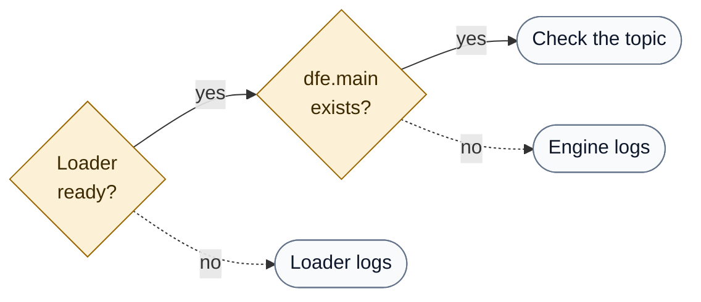
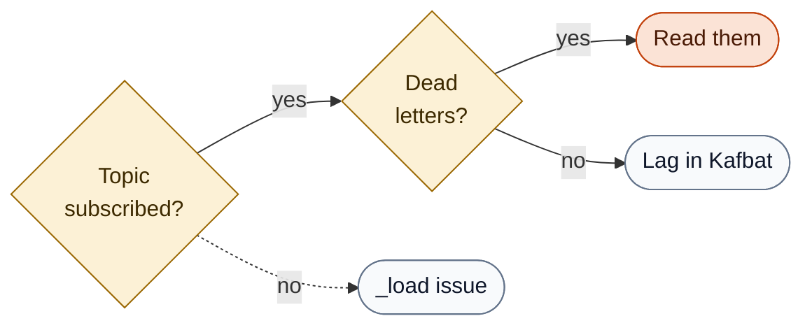

<!--
Project:   dfe-docker
File:      docs/troubleshooting.md
Purpose:   Reading stack state, then diagnosing accepted events that never land and the DLQ spool
Language:  Markdown

License:   BUSL-1.1
Copyright: (c) 2026 HYPERI PTY LIMITED
-->

# Troubleshooting the DFE Compose stack

This applies to you if a stack is misbehaving and you need to find out why --
yours or someone else's.

Start with the state of the stack, then the [known issues](known-issues.md), then the [common failures](common-failures.md) for the one you are actually chasing. Several of the known issues produce symptoms that look like something else entirely, so read them before you go deep.

## Reading the stack's state

`docker compose ps` (or `make ps`) is the first call. It shows which containers
exist and their health. `make down` tears down every profile, so a switch of
profile leaves no stray holding the old ports. `make ps` warns about a
per-source container left by a deleted source, which `make apply` removes.

Health endpoints, straight from the host. Every DFE service serves `/livez`,
`/readyz` and `/metrics` and nothing else -- the retired `/health*` paths 404, so
a probe left on one reads as a service that never came up.

```bash
curl -sf http://localhost:9091/readyz     # loader ready?
curl -sf http://localhost:8003/readyz     # engine ready?
curl -sf http://localhost:13133/          # collector healthy? (otel profile only)
```

These bind `127.0.0.1` by default, so curl them from the box. The full
port table, which path each HEALTHCHECK uses and why, and dfe-ui's 200-on-unknown
-paths trap are in [observability.md](observability.md).

If the stack sets `DFE_CONTAINER_PREFIX` (a second stack on the same host), every
raw `docker exec` / `docker inspect` / `docker logs` below needs that prefix on
the name -- `docker exec accept-dfe-clickhouse ...`. `docker compose` calls take
the service key and are unaffected.

With self-monitoring on, DFE's own services log through Docker's `fluentd` driver and `docker compose logs dfe-loader` still reads them back from the daemon's local copy. The same lines are in ClickHouse: search the `otel_logs` source in dfe-hyperdx or read them directly:

```bash
docker compose exec clickhouse sh -c 'clickhouse-client --password "$CLICKHOUSE_PASSWORD" --query \
  "SELECT Timestamp, Body FROM dfe.otel_logs WHERE ServiceName = '"'"'dfe-loader'"'"' ORDER BY Timestamp DESC LIMIT 50"'
```

dfe-hyperdx logs there. ClickHouse, the broker and the proxies keep `json-file`. To put every service back on it, set `DFE_CONTAINER_LOGS_ENABLED=false` and restart.

## Events are accepted but nothing lands

The ingest edge returning 2xx only means the event was accepted. Work down this
order.

Check the loader is ready before checking the schema.


```mermaid
flowchart LR
    accTitle: L4 Detail -- Loader and schema checks
    accDescr: First check that the loader is ready, then that dfe.main exists. A no on either names the logs to read. Two yeses move on to the topic and dead-letter checks.

    ready{"Loader<br/>ready?"}
    schema{"dfe.main<br/>exists?"}
    fixready(["Loader logs"])
    fixschema(["Engine logs"])
    next(["Check the topic"])

    ready -->|yes| schema
    ready -.->|no| fixready
    schema -->|yes| next
    schema -.->|no| fixschema

    classDef default fill:#F8FAFC,stroke:#64748B,stroke-width:1px,color:#0F172A
    classDef decision fill:#FCF1D6,stroke:#9A6700,stroke-width:1px,color:#3D2A00
    class ready,schema decision
```

*Figure 1. L4 Detail -- Loader and schema checks. Dotted arrows are where to look next.* Up: [L2 Services -- DFE Compose stack](architecture.md#events-arrive-two-ways-and-leave-one).

**Loader health first.** `curl -sf http://localhost:9091/readyz`. A loader that
cannot reach ClickHouse is the single most common cause, and readiness is what
tells you.

**Then the schema.** dfe-engine is the schema authority: it ships `/app/schemas`
inside its own image, creates the ClickHouse objects at startup, and the loader
pre-warms those schemas into its cache. Nothing in this repo provisions tables.
If the engine has not provisioned, the loader holds every message pending-schema
and dead-letters after a timeout. Check `dfe.main` exists and that the engine
is healthy.

On Kafka, check the loader's subscription before the dead letters.



```mermaid
flowchart LR
    accTitle: L4 Detail -- Topic and dead-letter checks
    accDescr: Check that the loader subscribed to the topic the receiver produces to, then whether the events were dead-lettered. A missing topic points at the _load known issue, dead letters are read, and with neither the consumer lag in Kafbat is next.

    topic{"Topic<br/>subscribed?"}
    dead{"Dead<br/>letters?"}
    fixtopic(["_load issue"])
    readdlq(["Read them"])
    lag(["Lag in Kafbat"])

    topic -->|yes| dead
    topic -.->|no| fixtopic
    dead -->|yes| readdlq
    dead -->|no| lag

    classDef default fill:#F8FAFC,stroke:#64748B,stroke-width:1px,color:#0F172A
    classDef decision fill:#FCF1D6,stroke:#9A6700,stroke-width:1px,color:#3D2A00
    classDef error fill:#FBE3D6,stroke:#C2410C,stroke-width:1px,color:#4A1A05
    class topic,dead decision
    class readdlq error
```

*Figure 2. L4 Detail -- Topic and dead-letter checks. The orange end means events were accepted and not delivered.* Up: [L2 Services -- DFE Compose stack](architecture.md#events-arrive-two-ways-and-leave-one).

**Then the topic.** On a Kafka profile, do not check that the topic exists -- check
what the loader actually SUBSCRIBED to. Those are different questions, and the gap
between them is where this hides: the loader logs the topic set it resolved, and
a topic can exist, be produced to, and still not be in it.

```bash
docker compose logs dfe-loader | grep "Resolved Kafka topics"
docker compose exec kafka-redpanda rpk group describe dfe-loader -X brokers=kafka:9092
```

If the topic the receiver produces to is missing from the resolved list, read the
[`main_load` issue](known-issues.md#a-_load-topic-changes-what-the-loader-reads) -- a `_load` sibling suppresses the `_land` topic.
Kafbat on `:8081` shows the produced-to topic and its high watermark, which is the
other half of the picture.

**Then the DLQ**, [below](#dead-letters-are-undelivered-events).

## The DLQ spool needs dlq-init

`dlq-spool` is a shared volume mounted at `/var/spool/dfe` by dfe-archiver,
dfe-fetcher, dfe-loader and dfe-receiver. All four run as non-root `appuser` (uid
1000), and none of the images pre-creates that path, so Docker creates the
mountpoint owned by root and no service can write inside it. The `dlq-init`
one-shot (`chown -R 1000:1000` over the spool, the archive, the fetcher cursors and the GeoIP store) fixes that before
the services start.

Without it, dfe-archiver crash-loops on `DLQ init failed ... Permission denied
(os error 13)` -- it creates its DLQ writer eagerly at startup. The others create
theirs lazily on first dead-letter, so they look healthy until something needs to
dead-letter, which is the worst moment to find the DLQ never worked.

`archiver-data`, mounted at `/var/lib/dfe-archiver/archive`, has the same problem and the same
fix. Without it every archive write fails with `Permission denied (os error 13)`,
and because dfe-archiver commits an offset only after a write succeeds, it never
commits one: the lag grows and nothing is archived.

`fetcher-cursors`, mounted at `/var/lib/dfe-fetcher`, gets the same fix. Without it every fetcher logs `Cursor directory is not writable` and re-fetches its lookback window on each restart.

Per-service volumes do not fix it: a fresh volume is root-owned, because
ownership is inherited from a path the image does not have, and no component
image creates `/var/spool/dfe` as appuser. The one-shot reuses the archiver image
because that image is pinned.

Three ways that arrangement fails:

1. `required: false` on the dependents means a **failed** dlq-init does not stop
   them -- Compose logs one warning and goes on with a zero exit. Watch for
   the warning.
2. uid 1000 is hard-coded and nothing verifies it, so an image that renumbers
   appuser breaks the DLQ silently.
3. In dev mode dlq-init runs `dfe-archiver:local`, so `make dev` builds the archiver from source even on profiles that run no archiver. `make dev LOCAL=...` without `dfe-archiver` in the list leaves dlq-init on the **registry** image instead, which needs GHCR access and a pinned `DFE_ARCHIVER_VERSION`.

## Dead letters are undelivered events

Files under `/var/spool/dfe/dlq` mean events were accepted and then could not be delivered. They are evidence, not noise: read them to see what was rejected and why. On a gRPC profile, where there is no broker, the loader writes its own dead letters there, under `dlq/loader/`. On a Kafka profile it writes them to the `dfe_loader_dlq` topic, which Kafbat on `:8081` shows, and to that file only when the broker does not take them.

```bash
docker compose exec dfe-loader ls -la /var/spool/dfe/dlq/loader
```

A row ClickHouse rejects with no working DLQ to take it is lost. The loader logs `No working DLQ` and counts it in `dfe_loader_rows_lost_total`, so any count there is data loss.

## An app stops at a one-shot

`service "config-check-dfe-loader" didn't complete successfully: exit 1` means the loader's config failed its own check, and the loader was never started. `docker compose logs config-check-dfe-loader` shows the app's error. Fix the config, then run `make apply SERVICES=dfe-loader`, which runs the check again first.

dfe-receiver mounts `.secrets/ingest/bearer-tokens` from the `dfe-engine-config` volume as a subpath, which Docker rejects when the path does not exist. The `bearer-tokens-init` one-shot creates it first, as uid 1000 and owner-only like the engine's other secrets. It is a directory mount so the engine's token rewrites reach the running receiver.

For the ports and settings behind all of this, see [operating.md](operating.md) and [configuration.md](configuration.md).
